# 羽球模擬器 · 羽球戰術工作室

選好四位球員，把腦中的雙打配合一拍一拍打出來。你可以自己決定球路與落點，也可以讓球員依照級數、性格與球風完成比賽，再回看哪一拍改變了局面。

[線上體驗](https://dan40912.github.io/AI/Badminton-Sandbox/) · [正式原始碼](https://github.com/dan40912/Badminton-Sandbox)

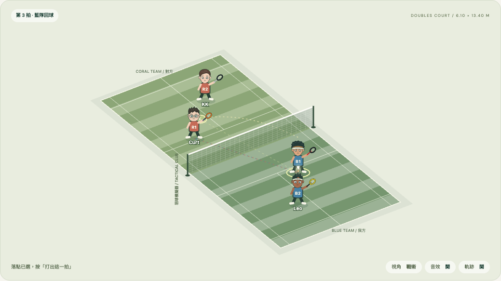

| 球場裡有什麼 | 可以怎麼玩 |
| --- | --- |
| 16 位原創角色 | 組建男雙、女雙或混雙，搭配不同的強項與弱點 |
| 3 種推演模式 | 逐球決策、自動回合，或全自動完成比賽 |
| 13 種回合球路＋3 種發球 | 從放網、平抽到跳殺，搭配合理的落點範圍 |
| 人物與絕招工坊 | 調整能力、球拍、專長、外觀與招式特色 |
| 重播與賽後分析 | 回看精彩回合、比較得分來源，從某一拍重新推演 |
| 桌機與手機介面 | 大螢幕看完整戰術，手機保留球場與固定操作列 |

## 組建你的雙打陣容

角色不只換名字。每個人都有自己的打法、偏好球路、專長與招牌絕技；喜歡後場進攻、網前控制或防守反擊，都能找到適合的搭檔。點選角色查看資料，或把角色拖進隊伍；隊伍位置也能交換。

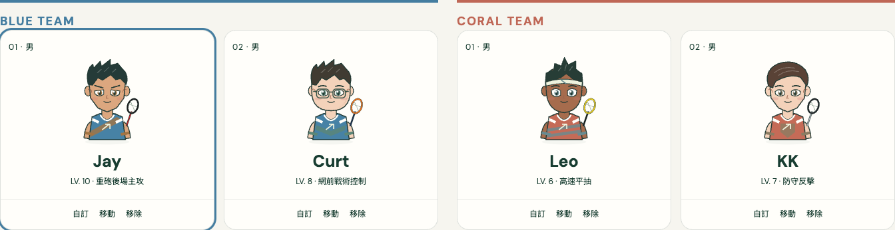

女雙角色包含 Rena、Mia、Ivy、Nora、Luna、Zoe、Ella 與 Aria。模式切換會顯示符合性別條件的角色；混雙可以從完整人物池選擇。

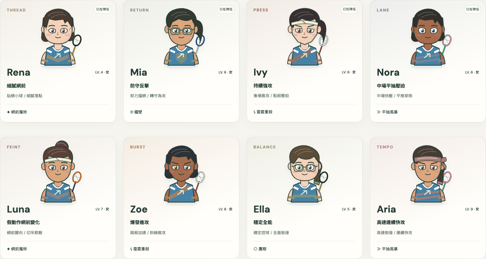

## 人物工作室：讓球員有自己的風格

級數 1–18 決定整體實力；性格影響冒險傾向，球風和能力分配則決定長處。五軸雷達呈現力量、速度、網前、防守與穩定，實線包含球拍與專長加成，虛線是原始能力。

<table>
  <tr>
    <td width="50%" valign="top">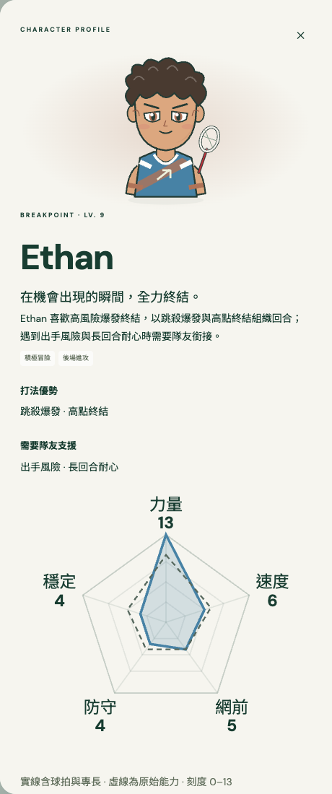</td>
    <td width="50%" valign="top">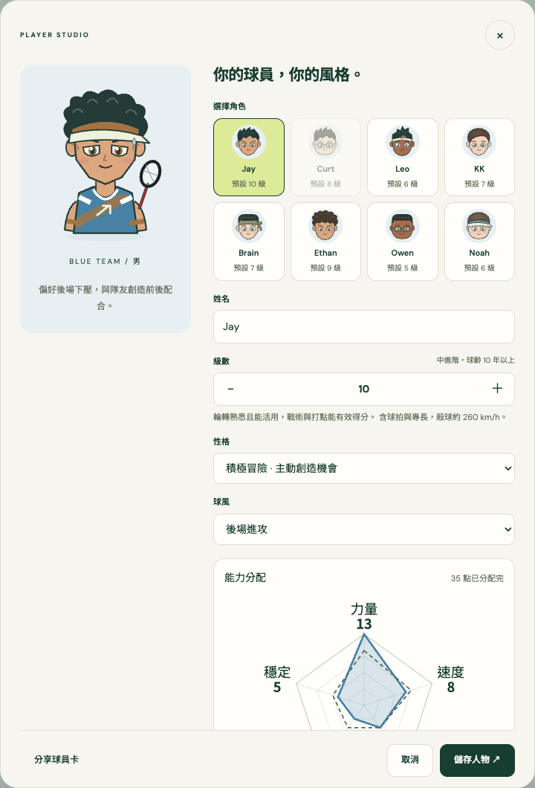</td>
  </tr>
  <tr><td>先看角色的強項與弱點。</td><td>再做成你想要的球員。</td></tr>
</table>

能力有分配預算，兩項專長各有取捨；球拍也會改變能力形狀。外觀提供 9 種髮型、3 種臉型、膚色、髮色與配件色，包含丸子頭、側編辮、捲髮和運動遮陽帽。設定可以儲存，也能分享為球員卡連結。

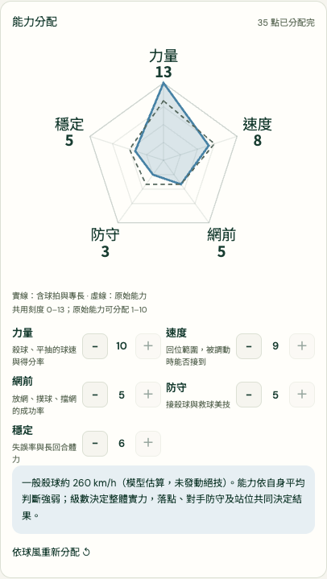

## 球路與落點，真的會影響下一拍

選擇擊球者、球路和落點後，球場會呈現軌跡與站位。你也能直接點球場選落點，或拖曳球員調整雙打配合。

發球與回合使用不同的落點限制：短發球只提供短點，偷後場與高遠發球只提供長點；挑球送往後場，吊球與放網留在前場。切換球路時，不相容的落點會清除，球場也會標示可選區域。

<table>
  <tr><th>短發球</th><th>偷後場／高遠發球</th></tr>
  <tr>
    <td width="50%" align="center">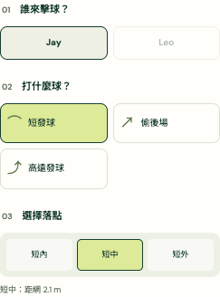</td>
    <td width="50%" align="center">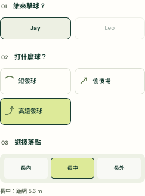</td>
  </tr>
</table>

除了前、中、後場落點，也能選擇「兩人中間」製造接球分工壓力，或打向左側／右側對手的腰部。這些目標會跟著對手站位移動；腰帶球以腰部高度接觸，不會被畫成落地球。

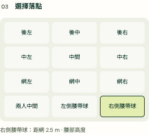

逐拍時間軸保留球路與球速。可以暫停、撤回、重播，或從某一拍之前分支，試試另一種選擇。戰術視角之外，也提供底線後方的透視鏡頭與可調高度。

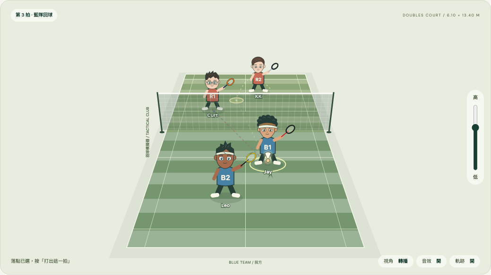

## 絕招工坊：設計你的招牌一擊

雷霆重殺、網前魔術、平抽風暴、鷹眼與鐵壁各有不同機制。主動絕技需要累積氣勢；鐵壁則是被動觸發。

工坊可以組合招式特色、發動代價與專屬色，也能自訂名稱。選擇爆發速度、假動作或精準控制，再決定要蓄滿 100 氣勢，還是承擔風險提早出手。試招畫布可以預覽效果，不改變正在進行的比賽。

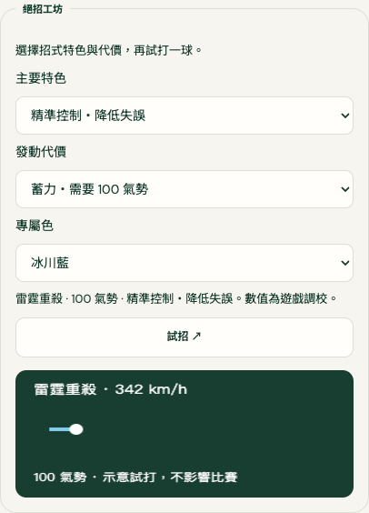

## 比賽結束後，看懂分數怎麼來

支援 11 分／21 分、一局決勝／三局兩勝。比賽完成後，結算表會列出局分、MVP，以及四位球員的得分率、失誤率、主動／被動比例與絕技出現率。

以下畫面來自實際跑完的一場自動比賽，不是手填的示意資料。

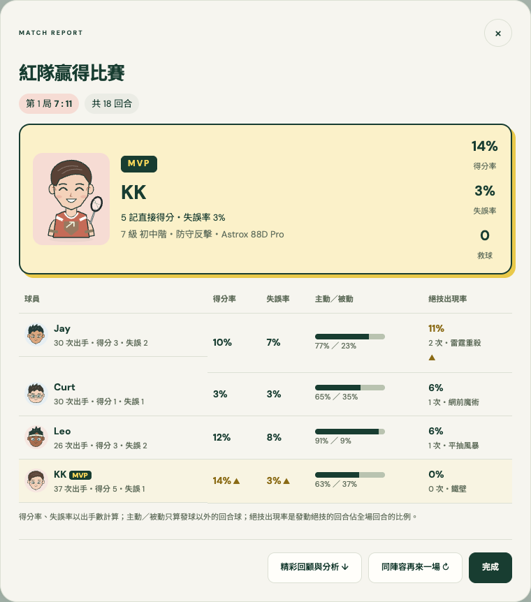

賽後分析會挑出最長回合、最快球速和絕技時刻，提供重播入口；也能比較直接得分與對手失誤，再讓球員對上五種同級球風，觀察模型中的強項與罩門。

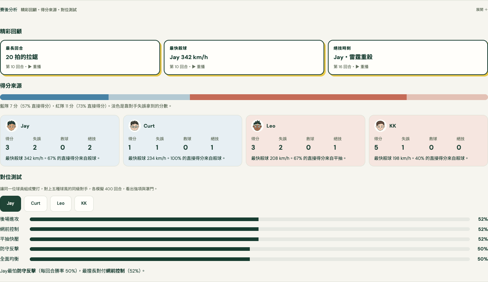

## 手機也能留在球場裡

手機版保留球場、比分與固定操作列，常用球路優先顯示，需要時再展開全部球路。人物資料改為底部面板，結算表則改為逐人閱讀。

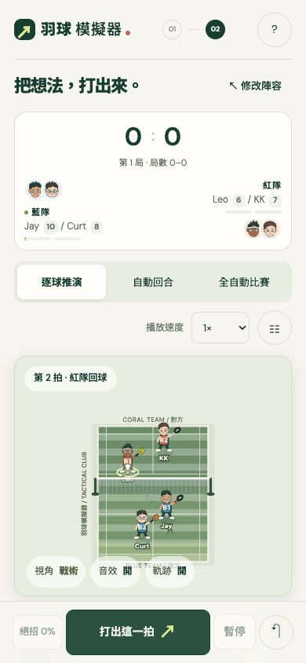

## 本機執行

這是純靜態應用：HTML、CSS、ES modules 與 Canvas，不需要後端，也沒有執行期套件依賴。人物與球場圖形由程式繪製；Google Fonts 為可選的網路字型，載入失敗時使用系統字型。

在本 repo 根目錄執行：

```bash
python3 -m http.server 8765 --bind 127.0.0.1
```

開啟 [本機預覽](http://127.0.0.1:8765/)。請使用 HTTP 伺服器，不要直接雙擊 `index.html`，因為應用使用 JavaScript modules。

比賽與人物設定保存在瀏覽器的 `localStorage`；清除網站資料會移除本機紀錄。可以匯出 JSON 保存推演，也可以透過球員卡連結分享人物。

## 開發與驗證

需要 Node.js，無須先安裝 npm 套件：

```bash
npm test
```

目前有 57 項 Node 測試，涵蓋發球與計分、完整賽事模擬、球路與飛行軌跡、視角投影、能力與絕技、人物卡相容性，以及動態落點與腰部高度。瀏覽器檢查紀錄見 [DESIGN-QUALITY.md](DESIGN-QUALITY.md)。

| 檔案 | 負責內容 |
| --- | --- |
| `model.js` | 比賽規則、選球、發球、軌跡與模擬 |
| `court.js`、`effects.js`、`audio.js` | 球場、視角、擊球效果與合成音效 |
| `characters.js`、`roster-ui.js` | 人物肖像、選角與隊伍操作 |
| `abilities.js`、`radar.js`、`workshop.js` | 能力、雷達、絕技與工坊 |
| `analysis.js`、`coaching.js` | 比賽分析與場邊提示 |
| `app.js`、`styles.css` | 操作流程、重播、儲存與響應式介面 |
| `docs/screenshots/` | README 使用的實際介面截圖 |

### 原始碼與展示副本

正式開發來源是 [dan40912/Badminton-Sandbox](https://github.com/dan40912/Badminton-Sandbox)。作品集中的 [AI/Badminton-Sandbox](https://github.com/dan40912/dan40912.github.io/tree/main/AI/Badminton-Sandbox) 是 GitHub Pages 展示副本。

同步方向：**正式 repo → 作品集副本**。程式、README 與截圖應一起更新；不從展示副本反向覆蓋正式來源。

### 模型範圍

這是簡化的羽球戰術模擬，不是真實比賽勝率預測器。球速、得分機率與對位結果是模型估算，能力雷達的面積也不代表勝率。路線推演模式允許手動判定回合勝方；發球高度、連擊與完整碰撞物理不在目前模型範圍內。
