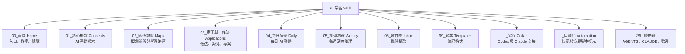

# 📂 全部筆記總覽

這篇是整個 vault 的 catalog：想知道「這裡有什麼、各檔做什麼、從哪開始」，先看這裡。一般學習請從 [[🏠 知識庫首頁]] 開始；想理解 AI 知識架構，接著讀 [[🗺️ AI 全景地圖]]。

## 資料夾圖例

- `00_首頁 Home/`：整個 vault 的入口、使用教學與總覽索引。
- `01_核心概念 Concepts/`：AI、Agent、Prompt、MCP、RAG 等基礎概念筆記。
- `02_關係地圖 Maps/`：把概念串成路徑與地圖的 MOC（Map of Content）。
- `03_應用與工作流 Applications/`：把概念落到工作流、案例、協作與專案規劃。
- `04_每日快訊 Daily/`：每日 AI 新聞與動態的存放區。
- `05_每週精選 Weekly/`：每週精選、深度摘要與趨勢整理。
- `06_收件匣 Inbox/`：臨時想法、待整理素材與快速擷取。
- `99_範本 Templates/`：新增概念、案例、快訊時使用的筆記範本。
- `_協作 Collab/`：Codex 與 Claude 的任務、回報、審查與專案範本。
- `_自動化 Automation/`：每日/每週策展與概念生成的自動化提示與說明。

## 從這裡開始

- [[🏠 知識庫首頁]] — vault 的主入口；新手、學習、應用與索引都從這裡分流。
- [[📖 使用教學 — 如何索引你的知識]] — Obsidian 新手教學，說明如何擷取、整理、連結與找回筆記。
- **本篇** — 完整盤點所有 `.md`，適合檢查檔案用途與位置。
- `歡迎.md` — Obsidian 預設歡迎頁，已改成導向首頁的一行指引。

## 核心概念

- [[AI 基礎概念]] — AI 領域的地基筆記；第一次理解整體範圍時看。
- [[LLM 大型語言模型]] — 說明 Large Language Model 的能力、限制與使用情境。
- [[Prompt 提示工程]] — 說明如何下指令、設計輸入與提高回覆品質。
- [[Context 脈絡與記憶]] — 說明模型當下能使用的資訊與記憶設計。
- [[Tool Use 工具呼叫]] — 說明 AI 如何呼叫工具、查資料、改檔或操作外部系統。
- [[Agent 代理]] — 說明能規劃、行動、觀察、修正的 AI Agent 迴圈。
- [[MCP (Model Context Protocol)]] — 說明 MCP 如何標準化連接工具、資料與應用。
- [[Skill 技能]] — 說明可重複使用的 Agent 能力封裝方式。
- [[RAG 檢索增強生成]] — 說明回答前先檢索資料的知識庫問答模式。
- [[Evaluation 評估]] — 說明如何用測試集與評分規則判斷 AI 輸出品質，避免改版退步。
- [[Guardrails 護欄]] — 說明如何限制 AI 的輸入、輸出、工具權限與資料存取風險。
- [[Feedback Loop 回饋迴圈]] — 說明如何把真實使用回饋轉成 prompt、資料、eval 與流程改善。
- [[Hybrid Search 混合搜尋]] — 說明如何結合語意向量搜尋與關鍵字搜尋，提升 RAG 命中率。
- [[Streaming 串流與延遲]] — 說明 AI 產品的等待時間、逐字輸出與體感延遲設計。
- [[Chunking 切塊策略]] — 說明如何切分文件片段，改善 RAG 檢索與引用品質。
- [[Data Pipeline 資料管線]] — 說明如何把筆記、文件與資料來源整理成 AI 可檢索的知識管線。
- [[Metadata Filtering 中繼資料過濾]] — 說明如何用 tags、日期、權限與狀態縮小 RAG 檢索範圍。
- [[Observability 可觀測性]] — 說明如何追蹤 AI 請求、檢索、工具呼叫、成本、延遲與錯誤。
- [[Cache 快取]] — 說明如何暫存檢索、embedding、工具結果或模型輸出以降低成本與延遲。
- [[Model Agnostic 模型無關]] — 說明如何避免應用綁死單一模型，支援切換、備援與路由。
- [[Self-Reflection 自我反思]] — 說明如何讓 Agent 在行動前後加入 review、critic 與修正迴圈。
- [[Ansible 自動化]] — 說明 Ansible 如何用 playbook、inventory、module 把 IT 維運與部署流程自動化。

## 關係地圖

- [[🗺️ AI 全景地圖]] — AI 概念的總地圖；用心智模型、流程與學習路徑串起全部核心筆記。

## 應用與工作流

- [[工作流範式]] — 整理常見 AI 工作流模式，適合設計自己的使用流程時看。
- [[多 AI 協作與多 Agent 工作流]] — 說明多個 AI 或多 Agent 如何分工、審查與整合。
- [[Codex × Claude 串接與自動協作]] — 說明 Codex 與 Claude 的交接協議與自動化協作方式。
- [[案例-自動策展知識庫]] — 用本 vault 的自動策展系統示範概念如何落地。
- [[專案規劃-Codex 個人學習知識庫]] — 本 vault 的專案規劃與演進方向。

## 每日、每週與收件匣

- [[_關於-每日快訊]] — 說明每日快訊放什麼、怎麼產生。
- [[_關於-每週精選]] — 說明每週精選 digest 的用途與檔名格式。
- [[_關於-收件匣]] — 說明 Inbox 用來暫存想法、連結與待整理素材。

## 範本

- [[概念筆記範本]] — 新增核心概念時使用，內含標準 frontmatter 與段落。
- [[應用案例範本]] — 新增工作流、案例或專案實作筆記時使用。
- [[每日快訊範本]] — 產生每日 AI 快訊時使用的格式。
- [[每週精選範本]] — 產生每週 AI 精選 digest 時使用的格式。

## 系統與協作

- `AGENTS.md` — Codex 操作本 vault 的規範，包含檢索順序、寫入規則與協作流程。
- `CLAUDE.md` — Claude 操作本 vault 的規範與角色說明。
- `_自動化 Automation/README.md` — 自動策展系統說明，包含每日、每週與概念生成流程。
- `_自動化 Automation/concept-builder-prompt.md` — 產生或整理概念筆記用的 prompt。
- `_自動化 Automation/daily-prompt.md` — 產生每日快訊用的 prompt。
- `_自動化 Automation/weekly-prompt.md` — 產生每週精選用的 prompt。
- `_協作 Collab/README.md` — Codex × Claude 交接區的使用說明。
- `_協作 Collab/task.md` — 本次任務與驗收標準。
- `_協作 Collab/report.md` — Codex 完工回報，供 Claude 審查。
- `_協作 Collab/review.md` — Claude 審查結果的固定位置。
- `_協作 Collab/task-template.md` — 建立新協作任務時可複製的任務範本。
- `_協作 Collab/prompts/01-plan.md` — Claude 規劃任務時使用的角色提示。
- `_協作 Collab/prompts/02-build.md` — Codex 實作任務時使用的角色提示。
- `_協作 Collab/prompts/03-review.md` — Claude 審查 Codex 成果時使用的角色提示。
- `_協作 Collab/prompts/04-integrate.md` — Codex 整合審查意見時使用的角色提示。
- `_協作 Collab/project-template/README.md` — 可複製到新專案的協作範本說明。
- `_協作 Collab/project-template/AGENTS.md` — 新專案中給 Codex 的操作規範範本。
- `_協作 Collab/project-template/CLAUDE.md` — 新專案中給 Claude 的操作規範範本。
- `_協作 Collab/project-template/docs/spec.md` — 新專案的實作規格範本。
