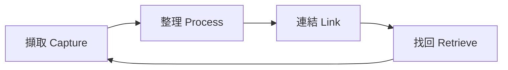
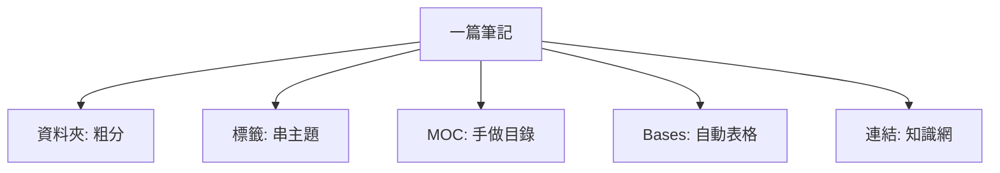

# 📖 使用教學 — 如何用 Obsidian 索引你的知識

> 給完全新手。讀完你就會：擷取 → 整理 → 連結 → 找回 你所有的知識。
> 邊讀邊做，每節最後有「✋ 動手做」。

---

## 0. 先懂一個核心觀念 The big idea

Obsidian 不是「資料夾工具」，是「**連結的筆記網**」。
- 每篇筆記就是一個 `.md` 純文字檔（存在你電腦上，永遠是你的）。
- 真正的威力來自 **`[[筆記連結]]`**：把相關知識串起來，形成一張會生長的網。
- **索引知識 = 讓未來的你（和 AI）找得到、連得到。** 三種索引方式：**連結**、**標籤**、**資料夾**。下面會逐一教。



---

## 1. 介面導覽 The interface
- **左側欄**：檔案總管（資料夾）、搜尋、書籤。
- **中間**：你正在編輯/閱讀的筆記。
- **右側欄**：大綱、**反向連結 Backlinks**（哪些筆記連到這篇——這就是知識網的價值）。
- **底部/側邊**：可開啟 **Graph view 關係圖**（看你的知識網全貌）。

**最該記住的 4 個快捷鍵（Windows）：**
| 快捷鍵 | 功能 | 何時用 |
|---|---|---|
| `Ctrl + O` | 快速切換/開啟筆記 | 想跳到任何一篇筆記 |
| `Ctrl + P` | 命令面板（所有功能入口）| 想不起來怎麼做時 |
| `Ctrl + Shift + F` | 全域搜尋（搜所有筆記內容）| 找一個關鍵字 |
| `Ctrl + E` | 切換「編輯/閱讀」模式 | 寫完想看排版效果 |

> 找不到某功能？一律 `Ctrl + P` 打關鍵字（例：打「graph」開關係圖、打「template」插入範本）。

✋ **動手做：** 按 `Ctrl + O`，輸入「全景」，跳到 [[🗺️ AI 全景地圖]]。再按 `Ctrl + P` 輸入「graph」打開關係圖，看看現在的知識網長怎樣。

---

## 2. 擷取：把東西先丟進來 Capture
別一開始就糾結放哪。先丟進 **`06_收件匣 Inbox`**，之後再整理。
- 新增筆記：`Ctrl + N`。
- 想到什麼、讀到好文章連結、會議筆記 → 都先丟 Inbox。
- **原則：擷取要零阻力，整理才講究。**

✋ **動手做：** `Ctrl + N` 建一篇筆記，隨手寫三行你今天想記的東西，存進 `06_收件匣 Inbox`。

---

## 3. 整理：用範本與屬性 Process with templates & properties
定期（例如每週）清空 Inbox：把每則丟到對的地方，並補上「屬性」。

### 用範本 Templates（已幫你設好）
`Ctrl + P` → 輸入「Templates: Insert template」→ 選範本（概念/案例/快訊）。
範本會自動帶出標準結構，不用每次從零開始。

### 屬性 Properties（筆記最上方的 YAML）
這是讓 **AI 與 Bases 能自動分類** 的關鍵。每篇填：
```yaml
type: concept | application | reference | project | map
tags: [主題標籤]
status: 🌱種子 | 🌿成長 | 🌳常青
updated: 2026-06-28
```
- `type`：這是什麼類型的筆記。
- `status`：成熟度——剛開的草稿是 🌱，整理好可長期參考的是 🌳。
- 把資訊放進屬性，首頁的 Bases 儀表板就會自動列出、分類。

✋ **動手做：** 打開你剛在 Inbox 寫的筆記，最上面加三行 `type:`、`tags:`、`status:`。

---

## 4. 連結：知識索引的核心 Link（最重要）
打兩個中括號 `[[` 就會跳出筆記清單，選一篇即建立連結。
- **連既有筆記**：`[[Agent 代理]]`。
- **連還沒建的筆記**：直接打 `[[量子計算]]`——它會變成「未來筆記」，點下去就能建立。這叫「**先連結、後撰寫**」，超好用。
- 連結越多，未來越容易從任一篇跳到相關知識。**這就是「索引」的本質。**

> 💡 心法：每寫一篇新筆記，問自己「這跟我已有的哪 2-3 篇有關？」然後連起來。

✋ **動手做：** 在 Inbox 那篇筆記裡，加一行 `相關：[[🗺️ AI 全景地圖]]`，存檔後到右側欄看那張地圖的「Backlinks」是否出現你的筆記。

---

## 5. 標籤：跨資料夾的分類 Tags
在內文或屬性用 `#標籤`（例：`#讀書筆記` `#工作` `#健康`）。
- 標籤跨資料夾分類：同一個 `#專案A` 可以同時標在概念、案例、會議筆記上。
- 點任一標籤，或開「標籤面板」，就能看到所有同標籤筆記。
- **資料夾用來放「一種東西」，標籤用來串「一個主題」。** 兩者互補。

✋ **動手做：** 給你的筆記加一個你會重複用的標籤，例如 `#我的主題`。

---

## 6. 索引「所有知識」的策略 Indexing everything
你不只要存 AI，要存所有必要知識。建議這樣擴充：

### A. 資料夾＝大類（粗分）
沿用目前的數字前綴邏輯，依你的生活/工作開新領域，例如：
```
10_工作 Work/
20_學習 Learning/
30_生活 Life/
40_參考資料 Reference/
```
> 別開太細。資料夾只負責「大致歸位」，細分交給標籤與連結。

### B. MOC 地圖筆記＝主題目錄（重點）
每個大主題建一篇 **MOC（Map of Content）**，像一本書的目錄，用 `[[ ]]` 列出該主題所有筆記。
- 你已經有一個範例：[[🗺️ AI 全景地圖]] 就是 AI 主題的 MOC。
- 新主題照做：建 `🗺️ 投資理財地圖`，裡面連到所有相關筆記。
- **MOC 是你親手做的索引**——比資料夾靈活，比搜尋直覺。

### C. Bases 儀表板＝自動索引
首頁的 Bases 會依 `type` / `tags` / `status` **自動**把筆記列成表。你只要好好填屬性，索引自己會長出來。



✋ **動手做：** 想一個 AI 以外、你最想累積的主題，建一篇 `🗺️ XXX 地圖` 放進 `02_關係地圖 Maps`，先寫三個 `[[未來筆記]]` 當待辦。

---

## 7. 找回：三種方式 Retrieve
1. **快速開檔** `Ctrl + O`：記得筆記名就用這個，最快。
2. **全域搜尋** `Ctrl + Shift + F`：只記得關鍵字就用這個。
3. **關係圖 / MOC / Backlinks**：靠連結「逛」到相關知識，常有意外收穫。

---

## 8. 讓 AI（我）幫你用這個庫 Use Claude with your vault
你的 vault 已設好讓我把它當參考來源（見根目錄 `CLAUDE.md`）。在這個資料夾開 Claude Code，你可以：
- **問答**：「根據我的 vault，解釋 MCP 和 Skill 差在哪」→ 我會讀你的筆記回答並附連結。
- **新增知識**：「把這個整理成一篇筆記放進 vault」→ 我幫你建好、填屬性、連好相關筆記。
- **自動策展**：「跑每日快訊」→ 自動抓 AI 新聞寫進 `04_每日快訊`（設定見 [[_自動化 Automation/README]]）。

> 這正是 [[RAG 檢索增強生成]]：你的 vault 是知識庫，我負責檢索與推理。庫越豐富，我越好用。

---

## 9. 建議的每週節奏 Weekly routine
1. **隨時**：想到/讀到 → 丟 `06_收件匣 Inbox`（零阻力）。
2. **每週一次**：清空 Inbox → 補屬性 → 移到對的資料夾 → 連結到相關筆記/MOC。
3. **每月一次**：逛關係圖，看看哪些孤島筆記該補連結、哪些 🌱 可以升級成 🌳。

---

## 10. 新手常見錯誤 Pitfalls
- ❌ 一開始就糾結資料夾結構 → 先擷取，結構會隨需求長出來。
- ❌ 只存不連 → 沒連結的筆記＝找不到的筆記。每篇至少連 1-2 篇。
- ❌ 標籤暴增 → 維持少量、會重複用的標籤就好。
- ❌ 追求完美筆記 → `🌱種子` 也是進度，先存再慢慢長。

---

### 🎯 下一步
- 回 [[🏠 知識庫首頁]] 看你的儀表板。
- 從 [[🗺️ AI 全景地圖]] 開始讀 AI 概念。
- 試著把今天學到的一件事，用上面的流程存成第一篇你自己的筆記。
