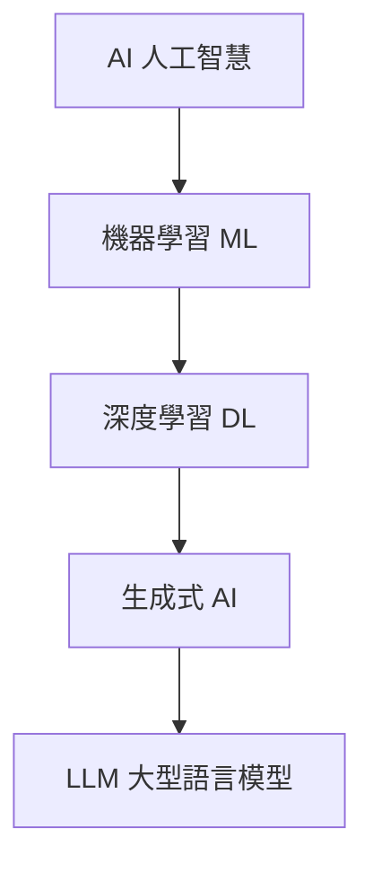

# AI 人工智慧 / Artificial Intelligence

> **一句話定義：** AI 是讓機器表現出「智慧行為」（理解、推理、生成、決策）的技術總稱；現在大家口中的 AI，多半特指以 **LLM** 為核心的生成式 AI。

## 1. 是什麼 What it is
AI 是一個大傘，底下有很多層：
- **機器學習 Machine Learning**：從資料中學規律，而非寫死規則。
- **深度學習 Deep Learning**：用神經網路（多層）學更複雜的表示。
- **生成式 AI Generative AI**：能「產生」新內容（文字、圖、程式、語音）。
- **LLM（大型語言模型）**：生成式 AI 的代表，也是 Agent / MCP / Skill 的引擎。

## 2. 為什麼重要 Why it matters
今天能「用一句話指揮電腦做事」的能力，幾乎都來自生成式 AI / LLM。理解這個層次，能讓你分得清「行銷術語的 AI」與「你真正會用到的 AI」。

## 3. 怎麼運作 How it works
核心是：**大量資料 → 訓練模型 → 模型學到模式 → 給新輸入、產生輸出**。現代 LLM 額外加上「指令微調」與「對齊」，讓它聽得懂人話、照指示做事。

## 4. 與其他概念的關係 Relations
- [[LLM 大型語言模型]]：現在 AI 的核心引擎。
- [[Agent 代理]]：讓 AI 不只回答、還能自己行動。
- [[Prompt 提示工程]]：你跟 AI 溝通的方式。
- 串接全貌見 [[🗺️ AI 全景地圖]]。

## 5. 實際應用 / 我可以怎麼用 Applications
- 寫作、摘要、翻譯、改寫。
- 寫程式、除錯、解釋程式碼。
- 當研究助理：搜尋 + 整理 + 比較。
- 自動化重複工作（搭配 [[Agent 代理]]）。

## 6. 常見誤解 Misconceptions
- ❌「AI 真的懂」→ 它是高明的模式預測，不是有意識。
- ❌「AI 不會錯」→ 會「幻覺 hallucination」，需查證。
- ❌「AI＝LLM」→ LLM 只是 AI 的一個分支，只是現在最熱。

## 7. 延伸閱讀 References
- 在本庫從 [[🗺️ AI 全景地圖]] 開始建立全局觀。
