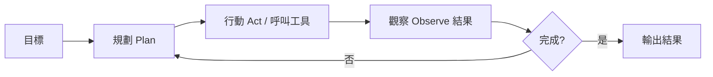

# Agent 代理 / AI Agent

> **一句話定義：** Agent 是一個「會自己規劃、行動、觀察結果、再調整」的 AI 系統——你給它目標，它自己跑完整個流程，而不是只回你一句話。

## 1. 是什麼 What it is
把 LLM 放進一個迴圈：**思考 → 用工具行動 → 觀察結果 → 再思考**，直到完成目標。Claude Code 本身就是一個 Agent：你說「幫我建知識庫」，它自己決定要建哪些檔、呼叫哪些工具、一步步做完。

## 2. 為什麼重要 Why it matters
這是「AI 會做事」與「AI 只會回答」的分水嶺。對你來說，Agent 是把重複、多步驟的工作整包自動化的方式（例：自動抓新聞→整理→寫進 vault）。

## 3. 怎麼運作 How it works

關鍵零件：
- **[[LLM 大型語言模型]]**：負責思考與決策（大腦）。
- **[[Tool Use 工具呼叫]]**：負責行動（手）。
- **[[Context 脈絡與記憶]]**：記住進度與中間結果。
- **[[Skill 技能]]**：可即插即用的能力模組。

## 4. 與其他概念的關係 Relations
- 是 [[Tool Use 工具呼叫]] 的「迴圈化」。
- 透過 [[MCP (Model Context Protocol)]] 接上更多工具與資料源。
- 用 [[Skill 技能]] 擴充專長。
- 多個 Agent 可以協作（multi-agent），見 [[工作流範式]]。

## 5. 實際應用 / 我可以怎麼用 Applications
- **本庫的自動策展**就是一個 Agent：定時抓新聞、整理、寫筆記。
- 研究任務：給主題，讓它搜尋＋比較＋產報告。
- 寫程式：交付一個功能，讓它讀碼、改碼、跑測試。

### Planning 規劃
Agent 的 Planning 是把目標拆成可執行步驟，決定先讀哪些資料、呼叫哪些工具、哪些結果需要驗證。好的 planning 不是列一長串待辦，而是先找出關鍵路徑：哪些資訊會阻塞下一步、哪些檢查可放到最後、哪些風險需要先降下來。

在實作上，可以把 planning 寫成「目標 → 需要的 context → 行動順序 → 驗收標準」。複雜任務可在每次工具回傳後重新規劃，並搭配 [[Self-Reflection 自我反思]] 檢查是否偏離目標；上線後則用 [[Observability 可觀測性]] 追蹤每一步行動與失敗點。

## 6. 常見誤解 Misconceptions
- ❌「Agent＝聊天機器人」→ 差別在「會自主多步行動」。
- ❌「Agent 全自動就不用顧」→ 仍需明確目標、權限邊界與檢查，會犯錯。
- ❌「Agent 越多越好」→ 多 Agent 增加協調成本，簡單任務單一即可。

## 7. 延伸閱讀 References
- [[🗺️ AI 全景地圖]]、[[案例-自動策展知識庫]]
