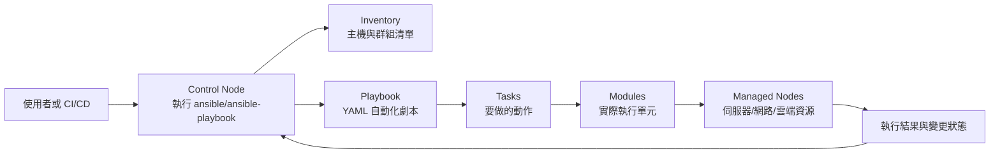

# Ansible 自動化 / Ansible

> **一句話定義：** Ansible 是一套開源 IT 自動化工具，用 YAML 把伺服器、網路設備、雲端資源與應用部署流程寫成可重複執行的「自動化劇本」。

## 1. 是什麼 What it is

Ansible 主要用來做 IT automation：包含 provisioning（建立基礎設施）、configuration management（設定管理）、application deployment（應用部署）、orchestration（多步驟協調）、patching、安全與合規作業等。

它的核心特色是 **agentless**：通常不需要在被管理的機器上長期安裝代理程式。你在一台 control node 上執行 Ansible，Ansible 透過 SSH、WinRM 或網路設備連線方式連到 managed nodes，將需要執行的 module 傳過去，完成後移除。

## 2. 為什麼重要 Why it matters

Ansible 把「手動登入每台機器做設定」變成「把預期狀態寫成文件，讓工具一致執行」。這對小型團隊到企業維運都很重要：

- 降低人工操作錯誤。
- 讓部署與設定可以版本控管。
- 讓環境可重現，減少「這台機器和那台不一樣」的問題。
- 把例行維運、修補、帳號設定、服務重啟、雲端資源建立等工作變成可審查的流程。

對 AI 工作流來說，Ansible 也可以被視為一種「外部行動工具」：AI Agent 可以產生、檢查或觸發 Ansible playbook，但實際改動基礎設施時仍需要權限、審查與可觀測性。

## 3. 怎麼運作 How it works



核心元件：

- **Control node**：執行 Ansible CLI 工具的機器，例如 `ansible-playbook`、`ansible`、`ansible-vault`。
- **Managed nodes**：被管理的目標，例如 Linux/Windows 伺服器、網路設備、雲端資源。
- **Inventory**：告訴 Ansible 要管理哪些主機、如何分組、每台主機有哪些變數。
- **Playbook**：用 YAML 寫的自動化劇本，描述哪些主機要被套用哪些任務。
- **Task**：一個具體動作，例如安裝套件、複製設定檔、啟動服務。
- **Module**：Ansible 實際複製到目標端執行的程式或二進位檔，用來完成 task。
- **Role**：可重複使用的 Ansible 內容包，通常包含 tasks、handlers、variables、templates、files 等。
- **Collection**：Ansible 內容的發佈格式，可包含 playbooks、roles、modules、plugins，常透過 Ansible Galaxy 安裝。
- **Ansible Vault**：加密 playbook 或變數中的敏感資訊，例如密碼、token、私鑰。

## 4. 與其他概念的關係 Relations

- 和 [[Tool Use 工具呼叫]]：Ansible 是 AI 或 CI/CD 可以呼叫的實際行動工具，但需要明確權限與審查。
- 和 [[Agent 代理]]：Agent 可以規劃維運任務，Ansible 則負責把任務穩定地執行到基礎設施上。
- 和 [[工作流範式]]：Ansible playbook 是典型的多步驟自動化流程，適合放進 CI/CD、維運流程或事件驅動自動化中。
- 和 [[Observability 可觀測性]]：自動化會改動真實系統，必須保留 job log、變更紀錄、失敗原因與回滾策略。
- 和 [[Data Pipeline 資料管線]]：若把資料基礎設施視為可部署系統，Ansible 可用來配置資料服務、排程器、監控與依賴套件。

## 5. 實際應用 / 我可以怎麼用 Applications

- **伺服器初始化**：建立使用者、安裝套件、設定防火牆、佈署 SSH key。
- **設定管理**：確保 Nginx、PostgreSQL、Redis、監控 agent 等設定一致。
- **應用部署**：拉取版本、放置環境檔、重啟服務、做滾動部署。
- **安全與合規**：套用 hardening 規則、修補套件、檢查設定漂移。
- **網路自動化**：管理交換器、路由器、防火牆設定。
- **雲端與混合環境**：管理 VM、網路、儲存、容器或跨雲資源。
- **AI/DevOps 結合**：讓 AI 協助產生 playbook 草稿，再由人審查後執行；或在受控流程中讓 Agent 觸發既有 playbook。

最小心智模型：

```yaml
- name: 安裝並啟動 nginx
  hosts: web
  become: true
  tasks:
    - name: 安裝套件
      ansible.builtin.package:
        name: nginx
        state: present

    - name: 啟動服務
      ansible.builtin.service:
        name: nginx
        state: started
        enabled: true
```

這段 playbook 的意思是：對 inventory 裡 `web` 群組的主機，以提升權限方式安裝 nginx，並確保服務已啟動且開機自動啟動。

## 6. 常見誤解 Misconceptions

- ❌「Ansible 只是 shell script」→ 它有 inventory、module、idempotency、變數、role、collection、vault 等結構，目標是把狀態與流程標準化。
- ❌「Agentless 代表不用權限」→ 仍然需要 SSH/WinRM/API 權限，也需要 sudo/become、金鑰與秘密管理。
- ❌「寫了 playbook 就一定安全」→ playbook 會改動真實系統，需要 code review、測試環境、dry run、備份與回滾策略。
- ❌「Ansible 和 Terraform 完全一樣」→ Terraform 偏 declarative infrastructure provisioning 與狀態管理；Ansible 更常用於設定管理、部署與流程編排。兩者常一起用。
- ❌「AI 可以直接自動改基礎設施」→ AI 可輔助撰寫或選擇 playbook，但 production 執行應該有人審查、最小權限、記錄與告警。

## 7. 延伸閱讀 References

- Ansible Community Documentation, "Ansible Documentation", 查詢日期：2026-06-29。https://docs.ansible.com/projects/ansible/latest/index.html
- Ansible Community Documentation, "Ansible concepts", 查詢日期：2026-06-29。https://docs.ansible.com/projects/ansible/latest/getting_started/basic_concepts.html
- Red Hat, "Learning Ansible basics", 更新日期：2026-02-09，查詢日期：2026-06-29。https://www.redhat.com/en/topics/automation/learning-ansible-tutorial
- Ansible Community Documentation, "Red Hat Ansible Automation Platform", 最後更新：2026-06-22，查詢日期：2026-06-29。https://docs.ansible.com/projects/ansible/latest/reference_appendices/tower.html
