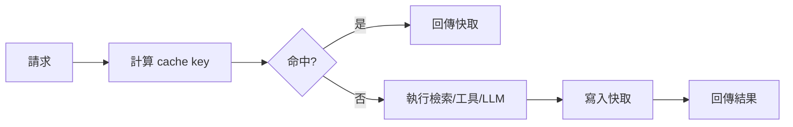

# Cache 快取 / Cache

> **一句話定義 One-liner：** Cache 是把可重用的輸入、檢索結果或模型輸出暫存起來，降低延遲、成本與重複計算。

## 1. 是什麼 What it is
在 AI 系統裡，Cache 可以出現在多個層級：資料檢索快取、embedding 快取、prompt/context 快取、模型回覆快取、工具呼叫結果快取。

它的核心問題是：哪些東西在短時間內不會變、可以重用？例如同一篇筆記的 embedding 不需要每次重算；同一個常見問題的檢索結果也可能短期有效。

## 2. 為什麼重要 Why it matters
LLM 按 token 與請求計費，檢索、工具呼叫與生成都會增加等待時間。Cache 可以節省成本，也能改善 [[Streaming 串流與延遲]] 前的等待。

但快取不是越多越好。AI 應用的答案常受資料版本、使用者權限與時間影響，如果快取失效策略錯誤，可能回傳過期或越權內容。

## 3. 怎麼運作 How it works

常見 key 來源包含：問題文字、模型版本、prompt 版本、資料版本、使用者權限、檢索 filters 與工具參數。

## 4. 與其他概念的關係 Relations
- [[LLM 大型語言模型]]：模型輸入與輸出都可能成為快取對象。
- [[Context 脈絡與記憶]]：快取 context 要小心資料版本與使用者權限。
- [[Streaming 串流與延遲]]：快取能降低首 token 前的等待，但不能取代良好互動設計。
- [[Model Agnostic 模型無關]]：抽象快取層可避免綁死單一模型供應商。

## 5. 實際應用 / 我可以怎麼用 Applications
- Obsidian 筆記未變更時，不重算該筆記 chunks 的 embedding。
- 對「解釋某概念」這類常見問題快取檢索結果，但保留重新生成答案的彈性。
- 對昂貴或限流的工具呼叫設定 TTL，例如 web lookup、API 查詢或大型文件解析。
- 在 prompt 版本變更時清掉相關快取，避免新規則被舊結果覆蓋。

## 6. 常見誤解 Misconceptions
- ❌「快取只是在加速」→ 它也影響成本、資料一致性、權限與錯誤擴散。
- ❌「相同問題就能共用答案」→ 使用者角色、日期、資料版本不同，答案可能不能共用。
- ❌「LLM 回覆都應該快取」→ 創作、個人化、高風險決策通常不適合直接回放舊答案。

## 7. 延伸閱讀 References
- [[Streaming 串流與延遲]]
- [[LLM 大型語言模型]]
- [[Context 脈絡與記憶]]
- [[Model Agnostic 模型無關]]
