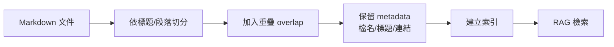

# Chunking 切塊策略 / Chunking Strategy

> **一句話定義：** Chunking 是 [[RAG 檢索增強生成]] 的延伸，決定文件要被切成哪些可檢索片段，直接影響 AI 找不找得到、看不看得懂資料。

## 1. 是什麼 What it is
Chunking（切塊策略）是把長文件切成較小片段，讓搜尋系統可以建立索引並在回答時取回相關內容。每個 chunk 通常包含一段文字、標題、來源與其他 metadata。

好的 chunk 應該「小到能精準命中，大到保留足夠脈絡」。太大會混入雜訊，太小會失去上下文。

## 2. 為什麼重要 Why it matters
RAG 的品質常常不是模型問題，而是資料切得不好。若一篇 Obsidian 筆記整篇當一個 chunk，搜尋可能命中但內容太雜；若每兩句切一次，模型又可能看不到前後關係。

對 Markdown、技術文件與知識庫來說，標題階層、清單、程式碼區塊、表格與 wikilink 都會影響切塊品質。切塊策略越貼近文件結構，AI 越容易找到可用答案。

## 3. 怎麼運作 How it works

常見設計：
- 依標題切：保留 Markdown 的章節結構。
- 固定大小切：例如每 500-1000 tokens 一塊，簡單但可能切斷語意。
- 加 overlap：相鄰 chunk 保留部分重疊，避免關鍵脈絡被切斷。
- 加 metadata：檔名、標題、日期、tags、wikilink，幫助搜尋與引用。

## 4. 與其他概念的關係 Relations
- [[RAG 檢索增強生成]]：chunk 是 RAG 檢索的基本單位。
- [[Hybrid Search 混合搜尋]]：切塊會影響向量搜尋與關鍵字搜尋的命中品質。
- [[Context 脈絡與記憶]]：取回的 chunk 會佔用 context，需要控制數量與大小。
- [[Evaluation 評估]]：應用 eval 比較不同 chunk 大小、overlap 與 metadata 策略。

## 5. 實際應用 / 我可以怎麼用 Applications
- Obsidian vault：優先依 `#`、`##`、`###` 標題切塊，並保留筆記名稱與 wikilink，方便答案連回來源。
- RAG 工具：測試不同 chunk size 與 overlap，用固定問題集比較答案是否更準。
- 產品文件：一個 chunk 最好包含完整步驟或完整限制，不要把「條件」和「結論」切開。
- Dify 或其他平台若提供 chunk 設定，不要只用預設值；先用 10-20 題 eval 觀察是否找得到正確段落。

## 6. 常見誤解 Misconceptions
- ❌「chunk 越小越精準」→ 太小會丟失脈絡，回答可能斷章取義。
- ❌「chunk 越大越完整」→ 太大會降低命中精度，也浪費 context。
- ❌「切完就不用管」→ 文件格式、標題品質與 metadata 都會持續影響檢索。

## 7. 延伸閱讀 References
- [[RAG 檢索增強生成]]
- [[Hybrid Search 混合搜尋]]
- [[Context 脈絡與記憶]]
- [[Evaluation 評估]]
