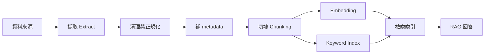

# Data Pipeline 資料管線 / Data Pipeline

> **一句話定義 One-liner：** Data Pipeline 是把原始資料穩定整理成 AI 可用知識的流程，通常包含擷取、清理、切塊、加 metadata、embedding、索引與更新。

## 1. 是什麼 What it is
在 AI 應用裡，Data Pipeline 不是單純「把檔案丟進資料庫」，而是把資料從來源轉成可檢索、可追蹤、可更新的知識資產。

典型流程像 ETL：Extract（擷取來源）、Transform（清理與結構化）、Load（載入索引或向量資料庫）。對 Obsidian vault 來說，來源可能是一篇 `.md` 筆記，轉換步驟包含讀 frontmatter、保留標題層級、依 [[Chunking 切塊策略]] 分段，再產生 embedding 與關鍵字索引，供 [[RAG 檢索增強生成]] 使用。

## 2. 為什麼重要 Why it matters
RAG 的回答品質先受資料管線限制。資料若沒有清理、切塊太粗、metadata 缺失、索引沒有更新，模型就算很強也只會引用錯片段或找不到資料。

對個人知識庫來說，Data Pipeline 的價值是把「我有很多筆記」變成「AI 能可靠查到對的筆記」。它也讓更新變得可控：新增筆記後只重建受影響片段，而不是每次整庫重跑。

## 3. 怎麼運作 How it works

常見欄位包含：來源檔案、標題、段落層級、tags、updated、chunk id、版本、權限、語言與摘要。

## 4. 與其他概念的關係 Relations
- [[RAG 檢索增強生成]]：Data Pipeline 是 RAG 的供料系統。
- [[Chunking 切塊策略]]：決定資料進索引前如何被分段。
- [[Hybrid Search 混合搜尋]]：常同時需要向量索引與關鍵字索引。
- [[Metadata Filtering 中繼資料過濾]]：依 metadata 控制搜尋範圍與權限。

## 5. 實際應用 / 我可以怎麼用 Applications
- 為 Obsidian vault 建 RAG 時，先定義哪些資料夾可索引、哪些 frontmatter 欄位必填。
- 每次更新筆記後只重建該筆記的 chunks 與 embedding，降低成本。
- 把 Daily/Weekly 快訊和核心概念分成不同索引或 metadata 類別，避免短期新聞污染常青知識。
- 對 Dify 或類似工具，先整理檔案結構與 metadata，再上傳知識庫。

## 6. 常見誤解 Misconceptions
- ❌「有 embedding 就有 Data Pipeline」→ embedding 只是其中一步，缺少清理、版本、metadata 與更新策略會很快失控。
- ❌「資料越多越好」→ 未整理的資料會讓檢索噪音變多；品質、結構與更新頻率更重要。
- ❌「一次建好就不用管」→ 筆記、產品文件與規則都會變，管線必須支援增量更新與重新索引。

## 7. 延伸閱讀 References
- [[RAG 檢索增強生成]]
- [[Chunking 切塊策略]]
- [[Hybrid Search 混合搜尋]]
- [[案例-自動策展知識庫]]
