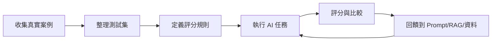

# Evaluation 評估 / AI Evaluation

> **一句話定義：** Evaluation 是用一組可重複的標準與案例，判斷 AI 輸出是否足夠好，並在改 prompt、RAG 或模型後確認品質沒有倒退。

## 1. 是什麼 What it is
Evaluation（eval）是 AI 系統的測試方法。它不像一般聊天只看單次感覺，而是準備一批代表性問題、期望行為與評分規則，反覆檢查 AI 回答是否正確、完整、安全、符合語氣與任務目標。

簡單說，eval 是把「我覺得這次回答不錯」變成「這類任務在這些案例上達到可接受標準」。

## 2. 為什麼重要 Why it matters
AI 系統一旦要產品化，就不能只靠手感調 prompt。你改了 [[Prompt 提示工程]]、換了模型、調整 [[RAG 檢索增強生成]] 的檢索策略，都可能讓某些舊案例變好、另一些案例變壞。

Evaluation 的價值是建立回歸測試：每次改動後跑同一批案例，快速看出品質是否退步。對個人知識庫來說，它可以檢查「問筆記」是否引用正確來源；對客服、法規、內部助理來說，它可以降低錯答與不一致回答。

## 3. 怎麼運作 How it works

常見做法：
- 建立測試集：收集真實問題、邊界案例、容易答錯的案例。
- 定義評分規則：例如正確性、完整性、是否引用來源、是否拒絕不該做的事。
- 設定基準版本：把目前可接受的結果當 baseline。
- 改動後重跑：比較新版本是否在關鍵案例上退步。

## 4. 與其他概念的關係 Relations
- [[Prompt 提示工程]]：eval 告訴你 prompt 修改是否真的變好，而不是只在少數例子變順。
- [[RAG 檢索增強生成]]：eval 可檢查檢索到的資料是否相關、答案是否有依據。
- [[Feedback Loop 回饋迴圈]]：真實使用者的讚、踩、修正案例會變成新的 eval 測試集。
- [[Guardrails 護欄]]：護欄也需要被測試，確認危險輸入會被正確拒絕或降級處理。

## 5. 實際應用 / 我可以怎麼用 Applications
- 為 Obsidian vault 準備 20 題常問問題，要求回答必須連回相關筆記，並檢查是否引用錯誤。
- 調整 Dify 或其他 RAG 應用前，先匯出一批真實問答作為測試集；改 chunk、檢索或 prompt 後重跑。
- 為 Agent 任務設計驗收案例，例如「新增筆記時 frontmatter 必須完整」「不可改動非任務範圍檔案」。
- 用簡單表格記錄：案例、期望、實際輸出、評分、錯誤原因、下一步修正。

## 6. 常見誤解 Misconceptions
- ❌「eval 一定要很複雜」→ 不一定。初期用 10-20 個高價值案例與人工評分，就能抓到很多退步。
- ❌「模型分數高就代表我的產品好」→ 通用 benchmark 只能參考，真正重要的是你的任務、資料與使用者情境。
- ❌「eval 只測答案對不對」→ 產品化還要測格式、引用、拒答、安全、成本與延遲。

## 7. 延伸閱讀 References
- [[Prompt 提示工程]]
- [[RAG 檢索增強生成]]
- [[Feedback Loop 回饋迴圈]]
- [[Guardrails 護欄]]
