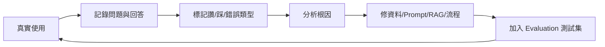

# Feedback Loop 回饋迴圈 / Feedback Loop

> **一句話定義：** Feedback Loop 是把使用者回饋、失敗案例與真實輸出收集起來，定期回頭修資料、prompt、eval 與工作流的改善迴圈。

## 1. 是什麼 What it is
Feedback Loop（回饋迴圈）是讓 AI 系統持續變好的機制。它不只收集「讚/踩」，還要保存問題、回答、使用情境、錯誤原因與修正結果，讓下一次改版有依據。

它的核心是把真實使用轉成可行動的改善素材：哪些問題常被問、哪些答案常錯、哪些資料缺漏、哪些 prompt 規則不清楚。

## 2. 為什麼重要 Why it matters
AI 系統第一次上線通常不是最穩的版本。真正的品質來自持續看真實案例，找出模型、資料、流程與使用者期待之間的落差。

對 [[RAG 檢索增強生成]] 來說，回饋可以揭露「其實缺筆記」「檢索不到正確段落」「答案沒有引用來源」。對 [[Evaluation 評估]] 來說，回饋則是新增測試案例的來源，避免同樣錯誤重複發生。

## 3. 怎麼運作 How it works

一個有效迴圈通常包含：
- 收集：保存問題、輸出、來源、使用者回饋。
- 分類：錯在知識缺漏、檢索失敗、prompt 不清、格式不符，還是工具權限。
- 修正：更新筆記、prompt、檢索設定、護欄或工作流。
- 驗證：把案例加入 eval，避免未來回歸。

## 4. 與其他概念的關係 Relations
- [[Evaluation 評估]]：回饋案例應轉成 eval 測試集，讓改善可驗證。
- [[RAG 檢索增強生成]]：回饋能指出知識庫內容、切塊與搜尋策略的缺口。
- [[Prompt 提示工程]]：常見錯誤可回頭改寫系統指令、格式要求與拒答規則。
- [[Guardrails 護欄]]：高風險或越界案例應回饋到護欄設計。

## 5. 實際應用 / 我可以怎麼用 Applications
- 在 Obsidian 建一篇「AI 回答錯誤案例」筆記，記錄問題、錯誤回答、正確答案、應更新的來源筆記。
- 對 Dify 或客服型應用加入讚/踩與「回報錯誤」按鈕，每週整理前 10 個失敗案例。
- 對 Codex 工作流保存 report 與 review，把 Claude 指出的問題回寫到 AGENTS、範本或 eval 清單。
- 建立固定節奏：每天收集、每週分類、每月更新測試集與工作流規則。

## 6. 常見誤解 Misconceptions
- ❌「有使用者按讚踩就叫回饋迴圈」→ 只有收集沒有修正與驗證，還不是迴圈。
- ❌「錯誤都是模型問題」→ 很多錯誤其實是資料缺漏、檢索策略或指令不清。
- ❌「回饋越多越好」→ 需要分類與優先級，先處理高頻、高風險、影響大的案例。

## 7. 延伸閱讀 References
- [[Evaluation 評估]]
- [[RAG 檢索增強生成]]
- [[Prompt 提示工程]]
- [[Guardrails 護欄]]
