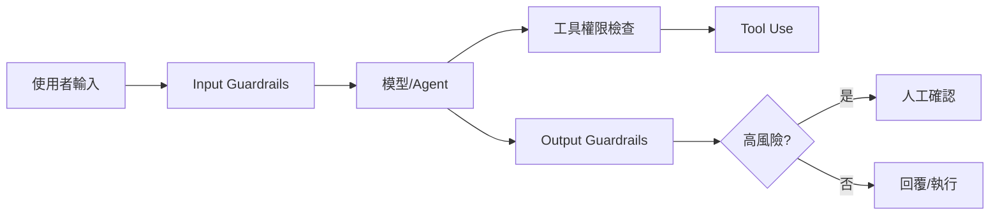

# Guardrails 護欄 / AI Guardrails

> **一句話定義：** Guardrails 是 AI 系統的行為邊界，用來限制輸入、輸出、工具權限與資料存取，避免越權、外洩或做出不該做的事。

## 1. 是什麼 What it is
Guardrails（護欄）是一組產品與技術規則，讓 AI 在可控範圍內運作。它可以出現在輸入端、模型推理中、工具呼叫前、輸出端與人工審核流程中。

護欄不是單一句「請安全回答」的 prompt，而是多層防線：哪些資料能看、哪些工具能用、哪些操作需要確認、哪些內容必須拒絕或改寫。

## 2. 為什麼重要 Why it matters
當 AI 只聊天時，錯誤多半是回答不準；當 AI 接上 [[Tool Use 工具呼叫]]、資料庫、檔案或自動化流程後，錯誤可能變成刪檔、外洩、越權查詢或錯誤下單。

產品化 AI 需要把「能力」和「權限」分開設計。[[Agent 代理]] 可以規劃與行動，但每一步行動都應該有邊界，特別是涉及私人資料、金流、法律、醫療、客戶資料與系統管理權限時。

## 3. 怎麼運作 How it works

常見護欄：
- Input guardrails：過濾 prompt injection、惡意指令、敏感資料。
- Tool guardrails：最小權限、允許清單、執行前確認、速率限制。
- Output guardrails：避免洩漏機密、避免不當建議、要求引用來源或固定格式。
- Human-in-the-loop：高風險操作交給人確認。

## 4. 與其他概念的關係 Relations
- [[Agent 代理]]：Agent 越自主，越需要明確護欄限制行動範圍。
- [[Tool Use 工具呼叫]]：工具權限是護欄的核心，特別是寫入、刪除、付款與發送訊息。
- [[Prompt 提示工程]]：prompt 可描述規則，但不能取代系統層權限與檢查。
- [[Evaluation 評估]]：護欄要用測試案例驗證，不能只假設它會生效。

## 5. 實際應用 / 我可以怎麼用 Applications
- Obsidian vault 助理可以讀很多筆記，但寫入時只允許特定資料夾，並要求 frontmatter 完整。
- Dify 或其他工作流工具中，把「查詢資料」與「更新資料」拆成不同權限，更新前要求確認。
- 對客服 AI 設定規則：不能承諾退款、不能編造政策、遇到帳務或法律問題轉人工。
- 對 Codex 類 Agent 設定：不可改名、刪除、搬移既有檔案；超出任務範圍列入 report。

## 6. 常見誤解 Misconceptions
- ❌「寫在 prompt 裡就安全」→ prompt 容易被繞過，仍需工具權限、資料隔離與審核。
- ❌「護欄越多越好」→ 過度限制會讓系統不可用，重點是按風險分級。
- ❌「只要模型夠聰明就不會越權」→ 權限設計不能依賴模型自律。

## 7. 延伸閱讀 References
- [[Agent 代理]]
- [[Tool Use 工具呼叫]]
- [[Prompt 提示工程]]
- [[Evaluation 評估]]
