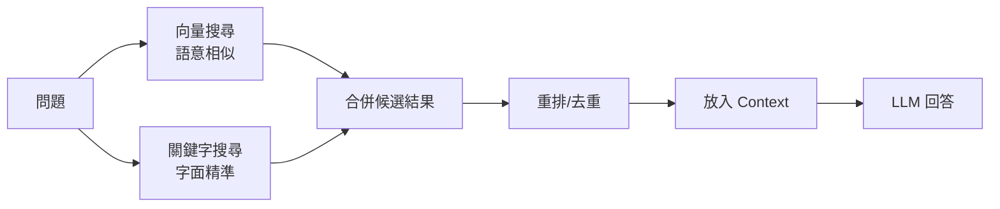

# Hybrid Search 混合搜尋 / Hybrid Search

> **一句話定義：** Hybrid Search 是 [[RAG 檢索增強生成]] 的延伸，把語意向量搜尋與關鍵字搜尋結合，讓 AI 同時找得到「意思相近」與「字面精準」的資料。

## 1. 是什麼 What it is
Hybrid Search（混合搜尋）通常結合兩種檢索方式：
- 向量搜尋（semantic search）：找語意相近的內容，適合概念、描述、同義改寫。
- 關鍵字搜尋（keyword search）：找字面精準匹配，適合人名、產品名、代碼、錯誤訊息、檔名。

在 RAG 中，混合搜尋的目的不是炫技，而是提高「找對資料」的機率。

## 2. 為什麼重要 Why it matters
只用向量搜尋時，AI 可能理解語意但漏掉精準詞；只用關鍵字搜尋時，又可能找不到換句話說的內容。產品化知識庫通常兩種需求都有。

例如你問「MCP server 連不上怎麼辦」，向量搜尋可能找到「工具連接」概念；關鍵字搜尋則能精準找到 `MCP`、`server`、錯誤碼或設定檔名稱。對 Obsidian 筆記、工程文件、客服知識庫來說，專有名詞與代碼常常不能只靠語意。

## 3. 怎麼運作 How it works

常見步驟：
- 同一個問題同時跑向量與關鍵字搜尋。
- 合併結果，去除重複與低品質片段。
- 用 rerank 或規則排序，把最有用的內容放進 [[Context 脈絡與記憶]]。
- 讓 LLM 根據檢索內容回答，而不是自由猜測。

## 4. 與其他概念的關係 Relations
- [[RAG 檢索增強生成]]：Hybrid Search 是 RAG 的檢索層強化。
- [[Chunking 切塊策略]]：切塊太粗或太碎，都會影響向量與關鍵字搜尋品質。
- [[Context 脈絡與記憶]]：搜尋結果最後要放進 context，必須取捨與排序。
- [[Evaluation 評估]]：需要用測試集比較「只向量」「只關鍵字」「混合」哪個更準。

## 5. 實際應用 / 我可以怎麼用 Applications
- Obsidian vault 問答：概念性問題用向量找相近筆記，檔名、wikilink、工具名用關鍵字補強。
- 工程知識庫：錯誤訊息、API 名稱、函式名需要關鍵字搜尋，設計說明與解法描述需要向量搜尋。
- Dify 或其他 RAG 工具若支援混合檢索，可以先用少量 eval 題比較命中率，再決定權重。
- 對重要查詢，把結果來源顯示出來，方便使用者判斷是否找對資料。

## 6. 常見誤解 Misconceptions
- ❌「向量搜尋比較新，所以一定比關鍵字好」→ 專有名詞、代碼、錯誤碼常常關鍵字更可靠。
- ❌「混合搜尋一定更準」→ 如果資料切塊差、排序差，混合只會帶來更多雜訊。
- ❌「檢索到很多資料就好」→ 放進 context 的內容越多，越可能稀釋重點或增加成本。

## 7. 延伸閱讀 References
- [[RAG 檢索增強生成]]
- [[Chunking 切塊策略]]
- [[Context 脈絡與記憶]]
- [[Evaluation 評估]]
