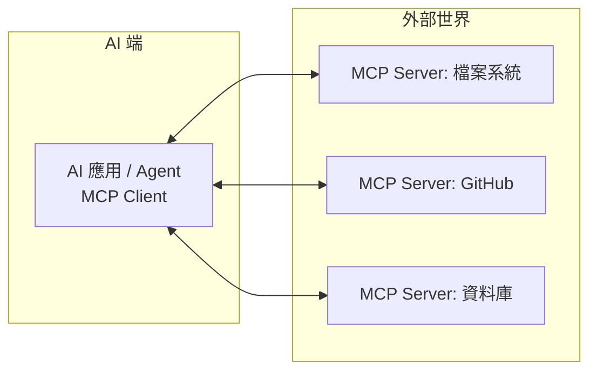

# MCP 模型情境協定 / Model Context Protocol

> **一句話定義：** MCP 是一套「**開放標準插頭**」，讓任何 AI 應用都能用同一種方式接上外部工具與資料源（檔案、資料庫、Slack、GitHub…）——就像 USB-C 之於各種裝置。

## 1. 是什麼 What it is
由 Anthropic 提出的開放協定。在 MCP 之前，每接一個工具都要為特定 AI 寫一套客製整合（M 個模型 × N 個工具 = M×N 套程式）。MCP 把它變成「M+N」：工具方做一個 **MCP server**，AI 方做一個 **MCP client**，兩邊照同一份協定對接即可。

## 2. 為什麼重要 Why it matters
這是 [[Agent 代理]] 生態能快速長大的基礎建設。你不用懂協定細節，但要知道：**看到某產品「支援 MCP」，代表你的 AI 助理可以即插即用地接上它的資料與功能。**

## 3. 怎麼運作 How it works

- **MCP Server**：把某個服務的能力（工具、資料）用標準格式「曝露」出來。
- **MCP Client**：AI 應用這一端，負責去發現並呼叫這些能力。
- 底層仍是 [[Tool Use 工具呼叫]]，MCP 只是把「怎麼接」標準化。

## 4. 與其他概念的關係 Relations
- [[Tool Use 工具呼叫]]：MCP 是它的「通用接線標準」。
- [[Agent 代理]]：靠 MCP 一次接上大量外部能力。
- [[Skill 技能]]：Skill 是「能力的打包」，MCP 是「連線的標準」——常被搞混，見下。

## 5. 實際應用 / 我可以怎麼用 Applications
- 在 Claude Code 裡裝 MCP server，就能讓助理操作瀏覽器、讀資料庫、連 Slack。
- 選工具時，「有沒有 MCP support」是它能否融入你 AI 工作流的指標。

## 6. 常見誤解 Misconceptions
- ❌「MCP＝Skill」→ MCP 是**連線協定**（怎麼接工具）；[[Skill 技能]] 是**能力打包**（教 AI 怎麼做某件事）。可以一起用。
- ❌「MCP 是某個產品」→ 它是開放標準，誰都能實作。

## 7. 延伸閱讀 References
- [[🗺️ AI 全景地圖]]
