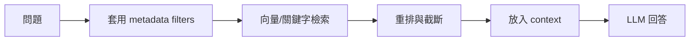

# Metadata Filtering 中繼資料過濾 / Metadata Filtering

> **一句話定義 One-liner：** Metadata Filtering 是在檢索前後用 tags、日期、來源、權限、狀態等欄位縮小候選資料，讓 RAG 找得更準、更安全。

## 1. 是什麼 What it is
Metadata 是資料本身之外的描述資料，例如 Obsidian frontmatter 的 `type`、`tags`、`status`、`level`、`updated`、`related`。Metadata Filtering 就是用這些欄位限制檢索範圍。

它是 [[RAG 檢索增強生成]] 的延伸：向量搜尋負責找語意相近的內容，metadata filter 負責先排除不該進來的內容。例如只查 `type: concept`，或排除 `status: 草稿` 的筆記。

## 2. 為什麼重要 Why it matters
只靠語意相似度，容易把語氣相近但情境錯誤的片段撈進來。Metadata Filtering 可以避免「問核心概念卻抓到每日快訊」、「問公開資料卻抓到私人草稿」、「問最新版規則卻抓到舊筆記」。

對產品化 RAG，metadata 也是權限與治理的基礎。不能只期待模型自己判斷什麼能看，應該在檢索層就先過濾。

## 3. 怎麼運作 How it works

常見 filter：
- 類型：只查 `concept`、`workflow`、`news`。
- 時間：只查最近 30 天，或只查某日期後更新的內容。
- 權限：依使用者角色限制資料集。
- 狀態：排除草稿、過期、待審查內容。

## 4. 與其他概念的關係 Relations
- [[RAG 檢索增強生成]]：metadata filter 讓 RAG 更像有條件的資料查詢，而不是盲目相似度搜尋。
- [[Hybrid Search 混合搜尋]]：混合搜尋處理語意與關鍵字；metadata filter 處理範圍與治理。
- [[Chunking 切塊策略]]：chunk 必須繼承來源筆記的 metadata，否則無法可靠過濾。
- [[Context 脈絡與記憶]]：過濾後只把相關內容放進 context，降低失焦與 token 浪費。

## 5. 實際應用 / 我可以怎麼用 Applications
- 查 vault 概念時限制 `type: concept`，避免把 task、prompt 或範本當成答案來源。
- 問「最新 AI 動態」時限制 `type: news` 或 `weekly`，並依 `updated` 排序。
- 對客戶文件做 RAG 時，將 `customer_id`、`permission`、`doc_status` 寫入 metadata。
- 對手動整理筆記加 `#manual` 或 `status: 🌳常青`，查重要知識時優先使用。

## 6. 常見誤解 Misconceptions
- ❌「metadata 只是整理用」→ 在 RAG 裡，它直接影響檢索範圍、權限與回答品質。
- ❌「tags 越多越好」→ tags 必須可預測、可維護；過度自由的 tags 會讓 filter 失效。
- ❌「向量搜尋會自己理解所有條件」→ 有些條件應由查詢層明確處理，而不是交給模型猜。

## 7. 延伸閱讀 References
- [[RAG 檢索增強生成]]
- [[Hybrid Search 混合搜尋]]
- [[Chunking 切塊策略]]
- [[Context 脈絡與記憶]]
