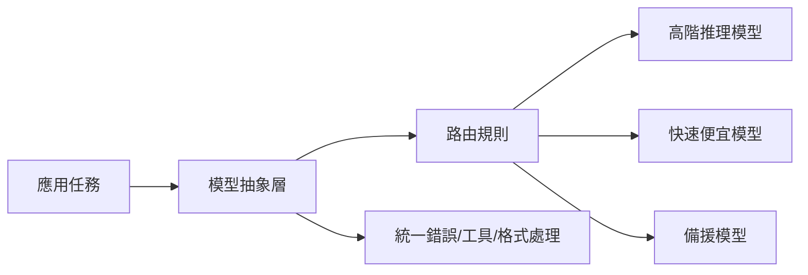

# Model Agnostic 模型無關 / Model Agnostic

> **一句話定義 One-liner：** Model Agnostic 是把應用設計成不綁死單一模型，讓你能依成本、速度、品質與風險切換或混用不同 LLM。

## 1. 是什麼 What it is
Model Agnostic 不是「完全不在乎模型差異」，而是把模型供應商、模型名稱、輸入輸出格式、工具呼叫格式與錯誤處理包在可替換的介面後面。

這讓系統可以在不同模型之間切換：強推理任務用高階模型，簡單分類用小模型；某供應商故障時切到備援；某模型價格變動時可重估路由。

## 2. 為什麼重要 Why it matters
AI 供應商、價格、模型能力與政策都會變。若 prompt、工具格式、評估與快取全綁死在單一模型，日後換模型會很痛。

模型無關設計讓你能保留選擇權，也能用 [[Evaluation 評估]] 比較不同模型在同一任務上的品質、成本與延遲。

## 3. 怎麼運作 How it works

抽象層通常處理：訊息格式、工具呼叫 schema、structured output、重試、超時、成本紀錄、模型能力標記與 fallback。

## 4. 與其他概念的關係 Relations
- [[LLM 大型語言模型]]：不同 LLM 能力、上下文長度、價格與延遲都不同。
- [[Evaluation 評估]]：切模型前後要用相同測試集比較。
- [[Cache 快取]]：cache key 必須包含模型與 prompt 版本，避免不同模型共用不該共用的結果。
- [[Observability 可觀測性]]：要追蹤每次請求用了哪個模型與成本。

## 5. 實際應用 / 我可以怎麼用 Applications
- 在 Dify 或自建 app 中，把「任務類型」對應到模型路由：摘要用快模型，程式審查用強模型。
- 設定 fallback：主模型超時或失敗時切到備援模型，並標記答案可信度。
- 建立一組 eval 題，比較不同模型在 vault 問答、筆記整理、程式修改上的表現。
- prompt 中避免寫死某供應商專屬詞，除非該任務確實依賴該能力。

## 6. 常見誤解 Misconceptions
- ❌「模型無關代表所有模型都一樣」→ 不一樣；抽象層只是讓差異可管理。
- ❌「抽象越厚越好」→ 過度抽象會遮住模型特有能力；需要保留能力標記與例外路徑。
- ❌「換模型只要改名字」→ 仍要重跑 eval、調 prompt、檢查工具呼叫與輸出格式。

## 7. 延伸閱讀 References
- [[LLM 大型語言模型]]
- [[Evaluation 評估]]
- [[Cache 快取]]
- [[Observability 可觀測性]]
