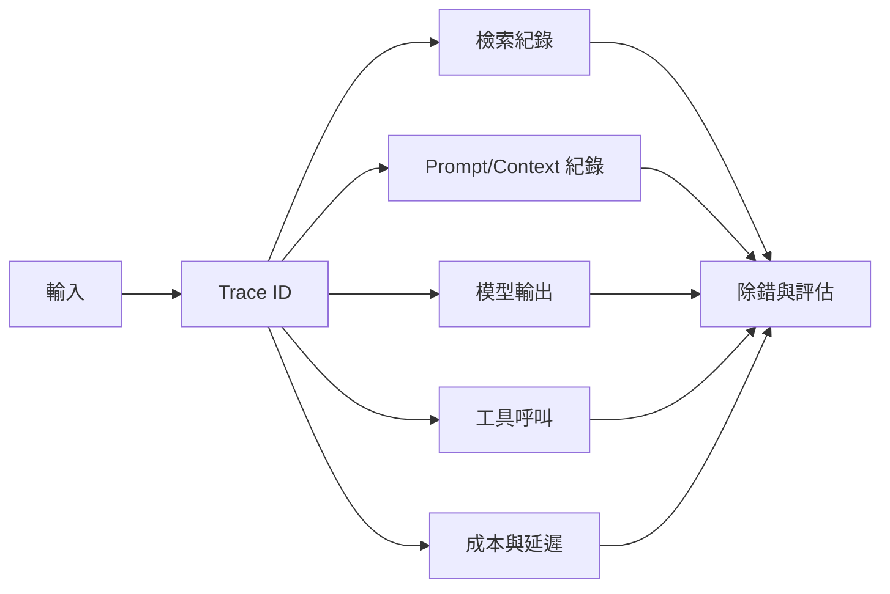

# Observability 可觀測性 / Observability

> **一句話定義 One-liner：** Observability 是讓 AI 系統的輸入、檢索、工具呼叫、模型輸出、成本與錯誤可追蹤，方便除錯、評估與改進。

## 1. 是什麼 What it is
Observability 不只是 logs。對 AI 應用來說，它要能回答：「使用者問了什麼？檢索抓到哪些資料？模型看到了什麼 context？呼叫了哪些工具？哪一步慢？哪一步錯？花了多少 token？」

產品化 AI 常需要三種紀錄：log（事件）、trace（一次請求跨多步驟的路徑）、metric（延遲、成本、錯誤率、命中率等指標）。

## 2. 為什麼重要 Why it matters
沒有 Observability，AI 錯了只能猜。RAG 錯誤可能來自檢索不到、檢索到錯資料、prompt 放錯順序、模型誤解、工具回傳錯誤或護欄拒答。Agent 任務更複雜，因為錯誤可能藏在某次中間工具呼叫。

可觀測性讓你把「AI 這次怪怪的」拆成可修的問題，並把真實失敗案例送回 [[Evaluation 評估]] 與 [[Feedback Loop 回饋迴圈]]。

## 3. 怎麼運作 How it works

敏感資料要先遮罩或摘要保存；Observability 不是無限制收集使用者隱私。

## 4. 與其他概念的關係 Relations
- [[Agent 代理]]：Agent 的 plan、act、observe 每一步都需要 trace。
- [[Tool Use 工具呼叫]]：工具輸入、輸出、錯誤與重試要可追蹤。
- [[Evaluation 評估]]：真實失敗 traces 可轉成測試案例。
- [[Feedback Loop 回饋迴圈]]：使用者回饋要能連回當次請求的上下文。

## 5. 實際應用 / 我可以怎麼用 Applications
- 對 RAG 問答保存：問題、命中 chunks、引用來源、最後答案與使用者評分。
- 對 Codex 類 Agent 任務保存：讀了哪些檔、改了哪些檔、跑了哪些測試、失敗原因。
- 追蹤 token 成本與延遲，找出哪類任務應該用快取、較小模型或簡化 context。
- 把高風險錯誤案例標記成 eval，之後改 prompt 或模型時重跑。

## 6. 常見誤解 Misconceptions
- ❌「有 logs 就夠」→ 多步驟 AI 系統需要能串起整個 trace，單點 log 不足以定位問題。
- ❌「全量保存 prompt 最安全」→ 可能造成隱私與資安風險；要遮罩、分級與保留期限。
- ❌「Observability 是上線後才做」→ 越晚補，越難還原錯誤與建立基準。

## 7. 延伸閱讀 References
- [[Agent 代理]]
- [[Tool Use 工具呼叫]]
- [[Evaluation 評估]]
- [[Feedback Loop 回饋迴圈]]
