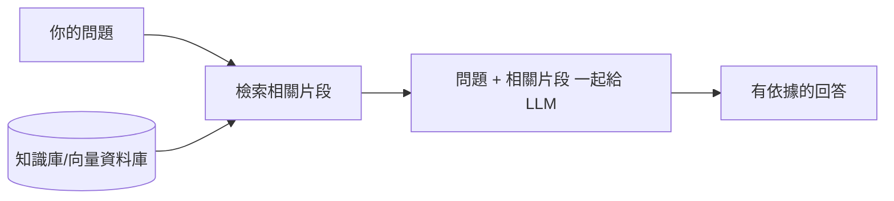

# RAG 檢索增強生成 / Retrieval-Augmented Generation

> **一句話定義：** RAG 是「先去資料庫找相關資料，再把它塞進 prompt 讓 LLM 參考著回答」的做法——讓模型能用最新／私有／你自己的資料，並大幅減少幻覺。

## 1. 是什麼 What it is
LLM 的知識停在訓練截止日，也不知道你的私人文件。RAG 的解法不是重訓模型，而是：**回答前先檢索 (Retrieval)，把找到的內容當作參考資料 (Augmented)，再生成 (Generation) 答案。**

## 2. 為什麼重要 Why it matters
這是讓 AI「懂你的資料」最實用、最省成本的方法，企業導入 AI 幾乎都用到它。理解 RAG，你就懂為什麼「上傳文件後問 AI」會比直接問準。

## 3. 怎麼運作 How it works

- **向量檢索 embeddings**：把文字轉成向量，用「語意相似度」找最相關段落（不是關鍵字比對）。
- 也可以用 [[Tool Use 工具呼叫]] 的搜尋工具當作一種「即時 RAG」。

## 4. 與其他概念的關係 Relations
- [[LLM 大型語言模型]]：RAG 餵它外部知識。
- [[Context 脈絡與記憶]]：檢索到的內容會佔 context 視窗，要取捨。
- [[Tool Use 工具呼叫]]：WebSearch 也是一種廣義 RAG。
- [[Data Pipeline 資料管線]]：決定資料如何清理、切塊、索引與更新。
- [[Metadata Filtering 中繼資料過濾]]：用類型、日期、權限或狀態縮小檢索範圍。

## 5. 實際應用 / 我可以怎麼用 Applications
- 把你的 Obsidian vault 當知識庫，做「問我的筆記」助理。
- 客服／法規／產品文件問答。

## 6. 常見誤解 Misconceptions
- ❌「RAG 會改變模型本身」→ 不會，它只是在「問的當下」補資料。
- ❌「有 RAG 就不會錯」→ 檢索到爛資料，照樣答錯（garbage in, garbage out）。

## 7. 延伸閱讀 References
- [[LLM 大型語言模型]]
- [[Data Pipeline 資料管線]]
- [[Metadata Filtering 中繼資料過濾]]
- [[Hybrid Search 混合搜尋]]
- [[Chunking 切塊策略]]
