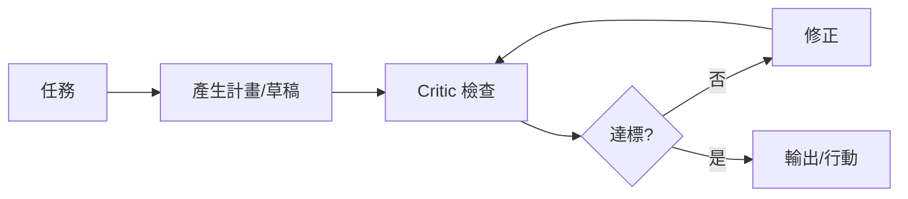

# Self-Reflection 自我反思 / Self-Reflection

> **一句話定義 One-liner：** Self-Reflection 是讓 AI 在輸出或行動前後檢查自己的推理、錯誤與缺口，常用於 Agent 的 review、critic 與修正迴圈。

## 1. 是什麼 What it is
Self-Reflection 不是讓模型「真的有自我意識」，而是把檢查步驟明確加入流程：先產生草稿或行動計畫，再請同一模型或另一個模型依標準審查，最後修正。

在 [[Agent 代理]] 裡，它常出現在 planning 後、工具呼叫後、最終輸出前。例如 Codex 完成任務前檢查是否跑過測試、是否有破鏈、是否改到非任務檔案。

## 2. 為什麼重要 Why it matters
LLM 容易自信地漏掉限制、格式或邊界條件。Self-Reflection 可以把「停下來檢查」制度化，降低草率輸出。

它特別適合多步驟任務：寫程式、整理知識庫、RAG 回答、研究報告、工具鏈操作。每一步都有可能出錯，反思迴圈能及早攔截。

## 3. 怎麼運作 How it works

檢查標準要具體，例如：是否引用來源、是否符合 frontmatter、是否有測試、是否越權、是否需要拒答。

## 4. 與其他概念的關係 Relations
- [[Agent 代理]]：反思可放在 plan、act、observe 迴圈中。
- [[Evaluation 評估]]：eval 是系統化測試；self-reflection 是單次任務內的自我檢查。
- [[Prompt 提示工程]]：反思步驟需要明確 criteria，不是只寫「請仔細檢查」。
- [[Guardrails 護欄]]：反思可檢查輸出是否碰到風險，但不能取代硬性護欄。

## 5. 實際應用 / 我可以怎麼用 Applications
- 讓 Agent 在動手前列出計畫與風險，完成後列出驗證結果。
- 對重要回覆加一輪 critic：檢查是否根據 vault、是否有斷鏈、是否過度推測。
- 多 Agent 工作流中，由審查者專門做 self-reflection 的外部化版本。
- 對 RAG 答案要求模型檢查「每個重要結論是否有來源片段支持」。

## 6. 常見誤解 Misconceptions
- ❌「叫模型反思就一定會變正確」→ 它仍可能錯；高風險任務要搭配 eval、工具驗證與人工審查。
- ❌「反思越多輪越好」→ 多輪會增加成本與延遲，也可能讓模型過度修改正確答案。
- ❌「self-reflection 可以取代測試」→ 它是流程檢查，不是可重複的品質基準。

## 7. 延伸閱讀 References
- [[Agent 代理]]
- [[Evaluation 評估]]
- [[Prompt 提示工程]]
- [[Guardrails 護欄]]
