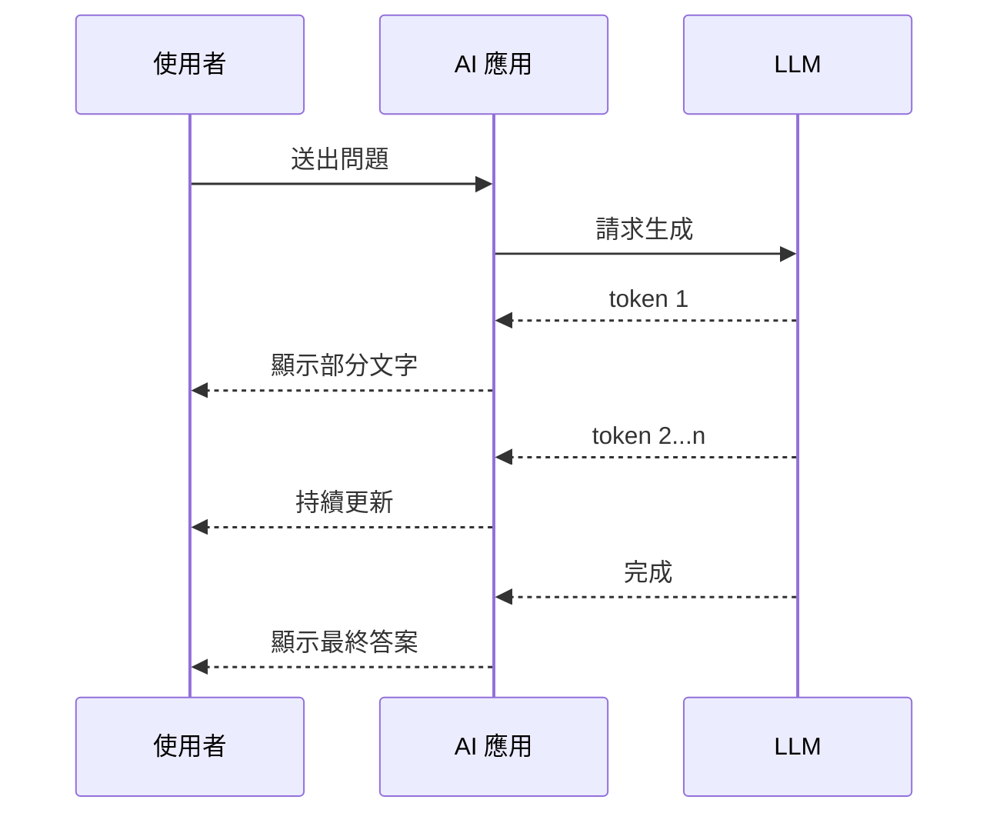

# Streaming 串流與延遲 / Streaming and Latency

> **一句話定義：** Streaming 是讓 AI 邊生成邊輸出；它不一定讓總時間變短，但能降低使用者「等不到回應」的體感延遲。

## 1. 是什麼 What it is
Streaming（串流）是模型生成 token 時，立刻把部分結果送回介面，而不是等完整答案生成完才一次顯示。Latency（延遲）則是使用者從送出請求到看到結果之間的等待時間。

在 AI 產品中，使用者感受到的不只是總耗時，還包含「多久看到第一個字」「過程是否有進度」「能不能提前判斷回答方向」。

## 2. 為什麼重要 Why it matters
AI 回答常需要檢索資料、組 prompt、呼叫工具、等待模型推理。若使用者 10 秒都看不到任何反應，會以為系統卡住；若 1-2 秒內開始串流，體感就會好很多。

但串流不是萬靈丹。某些任務需要完整輸出後才能驗證格式、做安全檢查或執行工具，這時候過早顯示可能造成誤解。產品化時要區分「可以邊看邊生成」與「必須先驗證再顯示」。

## 3. 怎麼運作 How it works

延遲常見來源：
- 檢索與工具呼叫：例如 RAG 搜尋、API 查詢、檔案讀取。
- Prompt 長度：[[Context 脈絡與記憶]] 越大，處理時間通常越長。
- 模型速度：不同 [[LLM 大型語言模型]] 的推理速度與成本不同。
- 後處理：格式驗證、引用整理、護欄檢查。

## 4. 與其他概念的關係 Relations
- [[LLM 大型語言模型]]：不同模型的生成速度、首 token 時間與輸出品質不同。
- [[Context 脈絡與記憶]]：context 越長，延遲與成本通常越高。
- [[Tool Use 工具呼叫]]：工具呼叫常是串流前的等待來源。
- [[Guardrails 護欄]]：某些輸出需要先通過安全或格式檢查，未必適合直接串流。

## 5. 實際應用 / 我可以怎麼用 Applications
- 聊天、摘要、寫作輔助適合串流，因為使用者可以邊看邊判斷方向。
- 報表、JSON、資料寫入指令不一定適合直接串流，應先驗證完整輸出。
- Obsidian 筆記助理若要長篇整理，可以先顯示「正在檢索哪些筆記」，再串流草稿。
- Dify 或其他 AI app 可以把長任務拆成狀態更新：檢索中、分析中、生成中、完成。

## 6. 常見誤解 Misconceptions
- ❌「Streaming 會讓模型算得更快」→ 多數情況只是提早顯示部分結果，總生成時間未必下降。
- ❌「所有 AI 功能都該串流」→ 高風險、需驗證格式或需一次提交的輸出，可能不適合。
- ❌「延遲只跟模型有關」→ 檢索、工具、context、網路與後處理都會影響。

## 7. 延伸閱讀 References
- [[LLM 大型語言模型]]
- [[Context 脈絡與記憶]]
- [[Tool Use 工具呼叫]]
- [[Guardrails 護欄]]
