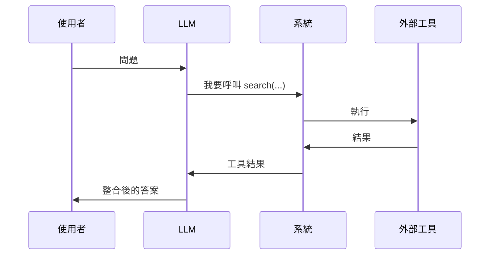

# Tool Use 工具呼叫 / Function Calling

> **一句話定義：** Tool Use 讓 LLM 不只「動嘴」回答，還能「動手」呼叫外部功能——查資料、算數學、發 email、改檔案。這是 LLM 從「聊天機器人」變「會做事」的關鍵一步。

## 1. 是什麼 What it is
你事先告訴模型「有哪些工具可用、各自要什麼參數」。當模型判斷需要時，它不直接回答，而是輸出一個「呼叫請求」（例：`search(query="今天台北天氣")`）。系統去執行，把結果回給模型，模型再據此回答。

## 2. 為什麼重要 Why it matters
LLM 本身有兩個天生限制：知識會過期、不能對真實世界做事。Tool Use 一次補上兩者——它是 [[Agent 代理]] 能成立的基礎，也是 [[MCP (Model Context Protocol)]] 想標準化的東西。

## 3. 怎麼運作 How it works

這個「呼叫→觀察結果→再決定」的循環，重複多次就成了 [[Agent 代理]]。

## 4. 與其他概念的關係 Relations
- [[LLM 大型語言模型]]：大腦。Tool Use 是它的「手」。
- [[Agent 代理]]：把 Tool Use 放進自動迴圈。
- [[MCP (Model Context Protocol)]]：讓「工具怎麼接」有統一標準，不用每個工具各寫一套。

## 5. 實際應用 / 我可以怎麼用 Applications
- 讓 AI 即時查網路（本庫每日快訊就是靠 WebSearch 工具）。
- 讓 AI 讀寫你的檔案、操作軟體。

## 6. 常見誤解 Misconceptions
- ❌「模型自己會上網」→ 不會，是系統提供工具、它選擇呼叫。
- ❌「給了工具就一定會用」→ 取決於 prompt 描述清不清楚、模型判斷需不需要。

## 7. 延伸閱讀 References
- [[MCP (Model Context Protocol)]]
