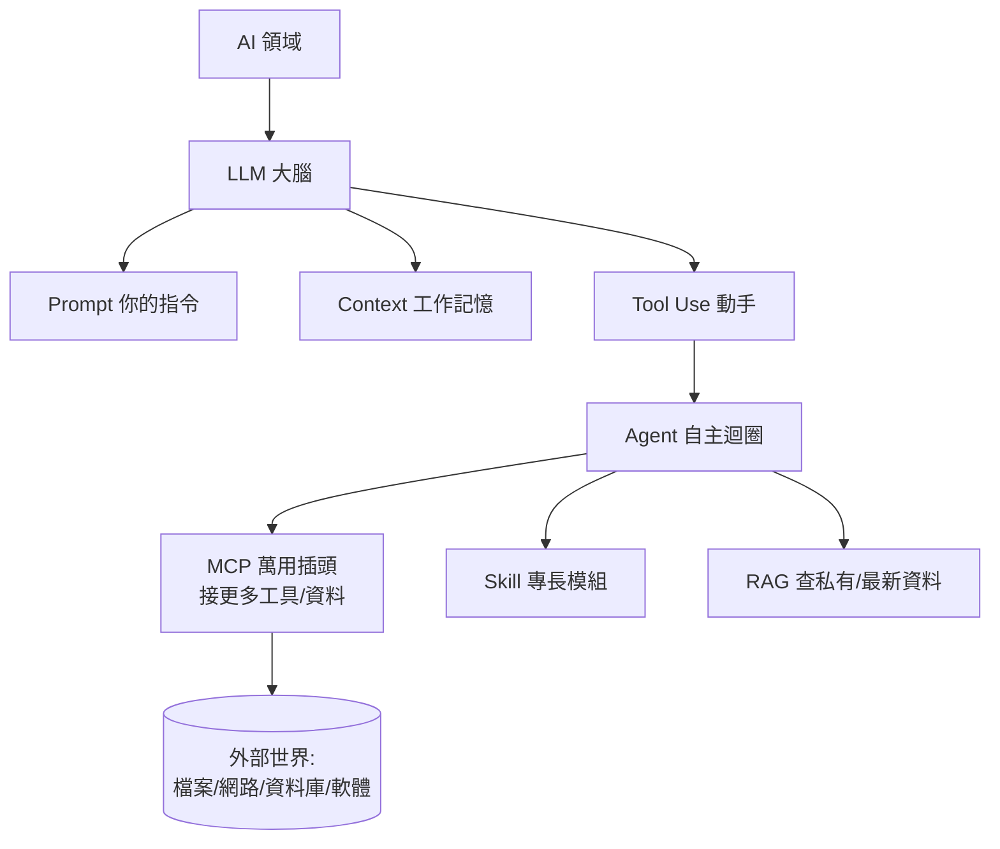
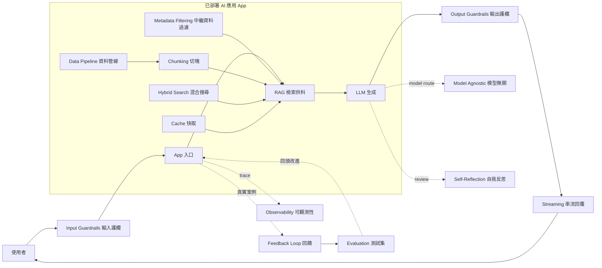

# 🗺️ AI 全景地圖 / Big Picture Map

> 這張地圖回答一個問題：**這些概念到底怎麼「拼」在一起？** 先看心智模型，再看組裝配方。

## 一句話心智模型 Mental Model

把它想成「打造一個會做事的 AI 員工」：

| 概念 | 比喻 | 角色 |
|---|---|---|
| [[LLM 大型語言模型]] | 🧠 大腦 | 思考、推理、生成 |
| [[Prompt 提示工程]] | 🗣️ 下指令 | 你怎麼交代任務 |
| [[Context 脈絡與記憶]] | 🧾 工作記憶 | 它當下記得什麼 |
| [[Tool Use 工具呼叫]] | ✋ 雙手 | 去做、去查、去改 |
| [[Agent 代理]] | 🤖 員工本人 | 自己規劃→行動→修正的迴圈 |
| [[MCP (Model Context Protocol)]] | 🔌 萬用插頭 | 標準化接上各種工具與資料 |
| [[Skill 技能]] | 🎓 專長證照 | 可即插即用的能力打包 |
| [[RAG 檢索增強生成]] | 📚 查資料 | 回答前先翻你的知識庫 |

## 串接流程 How it connects

**讀法：** LLM 是核心；你用 Prompt 指揮它，它受 Context 限制；給它 Tool Use 它就會動手；把這放進自動迴圈就是 Agent；Agent 透過 MCP 接上整個世界、用 Skill 補專長、用 RAG 讀你的資料。

## 從理解到上線 Production tier

當 AI 從「玩具 demo」變成「可交付工具」，問題會從「能不能回答」變成「穩不穩、可不可控、改版會不會退步」。這一層用 [[Evaluation 評估]] 檢查品質、用 [[Guardrails 護欄]] 管住風險、用 [[Feedback Loop 回饋迴圈]] 把真實案例回收成改進素材。

資料品質則靠 [[Data Pipeline 資料管線]]、[[Metadata Filtering 中繼資料過濾]]、[[Hybrid Search 混合搜尋]] 與 [[Chunking 切塊策略]] 強化 [[RAG 檢索增強生成]]；體驗品質則要理解 [[Streaming 串流與延遲]]、[[Cache 快取]] 與 [[Model Agnostic 模型無關]]，讓系統在成本、速度與穩定性之間可調整。Agentic 工作流還要用 [[Self-Reflection 自我反思]] 降低草率行動，並用 [[Observability 可觀測性]] 看見錯誤發生在哪一步。

## 🍳 組裝配方 Recipes（怎麼用來解決真實問題）

> 學會「點菜」比背菜單重要。看你想做什麼，對照要組哪些零件：

1. **「幫我把需求變成一段文字」** → [[LLM 大型語言模型]] + [[Prompt 提示工程]]。最基本，純對話即可。
2. **「問我自己的文件／筆記」** → LLM + [[RAG 檢索增強生成]]（把 vault 當知識庫）。
3. **「給我最新消息」** → LLM + [[Tool Use 工具呼叫]]（WebSearch）。
4. **「整包自動完成多步驟工作」** → [[Agent 代理]] = LLM + Tool Use 迴圈 + [[Context 脈絡與記憶]]。
5. **「讓 AI 操作我的軟體／資料庫」** → Agent + [[MCP (Model Context Protocol)]]。
6. **「把我的最佳做法變成可重複資產」** → 封裝成 [[Skill 技能]]。
7. **「讓多個 AI 互相研究、辯論、審查」** → [[Agent 代理]] + [[Context 脈絡與記憶]] + 明確角色分工；做法見 [[多 AI 協作與多 Agent 工作流]]。
8. **本庫的自動策展系統** = LLM + Agent 迴圈 + Tool Use(WebSearch/檔案) + Skill(策展範本)。完整拆解見 [[案例-自動策展知識庫]]。
9. **「把玩具變工具」** = 既有應用 + [[Evaluation 評估]] + [[Guardrails 護欄]] + [[Feedback Loop 回饋迴圈]]，再用 [[Data Pipeline 資料管線]]、[[Metadata Filtering 中繼資料過濾]]、[[Hybrid Search 混合搜尋]]、[[Chunking 切塊策略]]、[[Streaming 串流與延遲]] 補上檢索與體驗品質。
10. **「讓 Agentic 系統可維運」** = [[Agent 代理]] + [[Self-Reflection 自我反思]] + [[Observability 可觀測性]]，搭配 [[Cache 快取]] 與 [[Model Agnostic 模型無關]] 控制成本、延遲與模型切換風險。

## 學習路徑建議 Learning Path
1. 先讀 [[AI 基礎概念]] → [[LLM 大型語言模型]] 建立地基。
2. 再讀 [[Prompt 提示工程]] + [[Context 脈絡與記憶]]（最快見效的應用技能）。
3. 然後 [[Tool Use 工具呼叫]] → [[Agent 代理]]（從「會答」到「會做」）。
4. 最後 [[MCP (Model Context Protocol)]] + [[Skill 技能]] + [[RAG 檢索增強生成]]（生態與進階）。
5. 做到產品化時，接著讀 [[Evaluation 評估]]、[[Guardrails 護欄]]、[[Data Pipeline 資料管線]]、[[Observability 可觀測性]]。
6. 邊學邊看每日／每週快訊，把新聞對照回這些概念。
