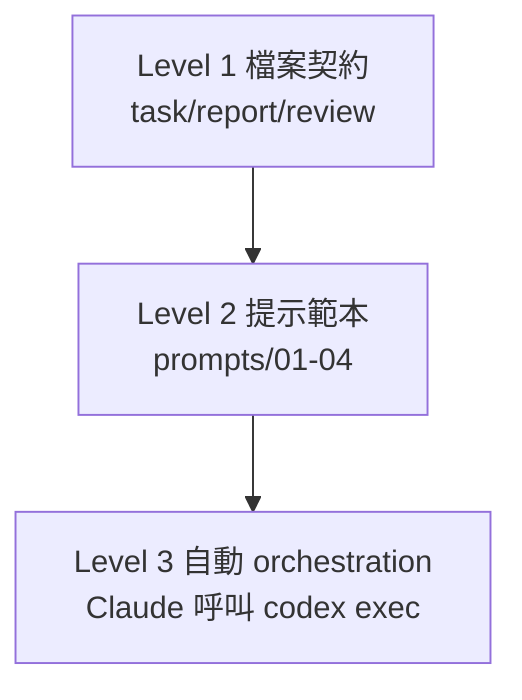

# Codex × Claude 串接與自動協作

> 目標：讓 Claude（規劃＋審查）與 Codex（實作＋整理）**自動配合**——用在「持續擴充這個 vault」與「在其他專案套用固定 workflow」。操作檔在 `_協作 Collab/`。

## 核心觀念：靠檔案契約，不靠記憶
兩個 AI 不共享記憶、每次都是冷啟動，所以協作的關鍵是一份**共用的檔案契約**＋**固定角色分工**：

| 角色 | 由誰 | 負責 |
|---|---|---|
| 規劃者 Planner | Claude | 把需求變成規格 |
| 實作者 Builder | Codex | 讀寫檔案、落地實作 |
| 審查者 Critic | Claude | 找盲點、反方審查 |
| 整理者 Archivist | Codex | 依審查修正、寫回 |
| 拍板 | 你 | 定目標、做最後決策 |

交接三件檔（在 `_協作 Collab/`）：`task.md`(任務) → `report.md`(Codex 回報) → `review.md`(Claude 審查)。

## 三個自動化層級

- **Level 1 契約**：最穩，換 session 也接得上。
- **Level 2 範本**：四步提示固定下來，不用每次重打。
- **Level 3 自動**：Claude（我）用 Bash 呼叫 `codex exec` 驅動 Codex，再由我審查、迴圈。

## 怎麼用

### 用途 A：持續擴充這個 vault
- **全自動**：在 Claude Code 說「用 codex 擴充 vault：<主題>」→ 我呼叫 `_協作 Collab/orchestrate-vault.ps1`，Codex 寫入 vault 並更新 `report.md`；再說「審查這次 codex 的改動」由我寫 `review.md`。
- **半自動**：自己跑
  ```powershell
  cd "D:\obsidian\個人學習\個人學習"
  powershell -File "_協作 Collab\orchestrate-vault.ps1" "把 Agent 代理 補上 2026 multi-agent 段落"
  ```
- **稽核（唯讀）**：`... orchestrate-vault.ps1 -Sandbox read-only "列出孤島筆記與缺 frontmatter 的檔"`。

### 用途 B：其他 code 專案的固定 workflow
把 `_協作 Collab/project-template/` 複製到新專案根目錄，照其 README 跑「Claude 規劃→Codex 實作→Claude 審查→Codex 整合」。詳見該範本。

## 環境設定（本機已驗證）
- **Codex CLI**：`C:\Users\dan40\AppData\Local\OpenAI\Codex\bin\codex.exe`（v0.130，未加進 PATH）。
- **三個必要參數**（踩過的雷）：
  1. `--skip-git-repo-check`：vault 非 git repo，否則 `codex exec` 會卡在 repo 檢查。
  2. `-c service_tier="fast"`：config.toml 的 `service_tier` 在 exec 路徑只接受 `fast`/`flex`。
  3. 用**完整路徑**呼叫，別用 PATH 上的 WindowsApps `codex.exe`（會「存取被拒」）。
- **Sandbox**：寫檔 `workspace-write`、唯讀分析 `read-only`、完全放開 `danger-full-access`（不建議）。

## 進階：Codex 作為 MCP server
`codex mcp-server` 可讓 Codex 以 [[MCP (Model Context Protocol)]] 對外服務，未來能讓 Claude Code 以 MCP client 直接連 Codex，比腳本呼叫更原生（目前先用 `codex exec` 腳本即可）。

## 如何稽核：確認 Codex 真的有跑（重要）
別只信任何一方的「我做完了」。Codex 每次 `codex exec` 都會把完整對話與動作寫進**自己的 session log**（Claude 無法偽造），可拿來逐項核對。

**Log 位置**：`C:\Users\<你>\.codex\sessions\YYYY\MM\DD\rollout-<時間>-<sessionId>.jsonl`

**三步驗證法**：
1. **時間戳對得上**：log 檔的時間應對應你/Claude 觸發 orchestration 的時刻；每次跑是一個獨立 `sessionId`。
2. **看「餵進去的 prompt」**：log 裡 `"role":"user"` 的訊息，應是 `AGENTS.md` + `02-build.md`（經 stdin 灌入）→ 證明是被誰、用什麼指令驅動。
3. **看「實際動作」**：log 裡 `function_call` / `shell_command`（如 `Move-Item`、`apply_patch`）就是 Codex 真正執行的檔案操作 → 證明改檔是 Codex 做的，不是 Claude 代筆。

**稽核指令**：
```powershell
# 列出當天 session（最新在最上）
Get-ChildItem "$env:USERPROFILE\.codex\sessions\2026\06\28" | Sort-Object LastWriteTime -Descending
# 直接 resume 進最近一次 session 看完整對話
codex resume --last
# 在某個 session 找特定動作（例：改名）
Select-String -Path "<session.jsonl>" -Pattern "Move-Item|apply_patch"
```

> 另一個旁證：每次 PowerShell 輸出的 `OpenAI Codex v0.130 / model: gpt-5.5 / tokens used / git diff / PID terminated` 都是 Codex CLI 的原生輸出（model 是 gpt-5.5，與 Claude 不同程序、不同模型）。

## 分工要記清楚（誰寫了什麼）
- **Claude（model = Opus）寫的**：`task.md`（規劃）、`review.md`（審查）。
- **Codex（獨立程序，model = gpt-5.5，獨立 session）寫的**：實際的筆記內容、檔案改名、`report.md`。
- **串接方式**：Claude 用 Bash 跑 `orchestrate-vault.ps1 -Bypass` → 呼叫 `codex exec` 並由 **stdin** 灌入 prompt → Codex 當作另一個程序執行、改檔、寫 `report.md` → Claude 讀檔審查、寫 `review.md`。

## 實戰驗證紀錄（2026-06-28）
首次完整跑「全部 md 收錄與規劃」閉環，並用上述方法稽核通過：
- 第一輪（建 [[📂 全部筆記總覽]]）：session `019f0ed5-6810-7553`，~233 KB，含 `全部筆記總覽` 22 次、apply_patch/shell 4 次。
- 第二輪（依 review 改名修正）：session `019f0edc-0c0b-73d2`，~183 KB，含新檔名 `_關於-每日快訊` 16 次、Codex 自發 `Move-Item` 改名三檔。
- 旁證：使用者自己手動跑的 read-only 測試是另一個 session `019f0ec7-4f79-7283`，與上述兩輪分開。
- 結論：規劃→Codex 執行→Claude 審查→Codex 修正→Claude 最終 review，全鏈可稽核、PASS。

## 安全與心法
- 寫入型任務完成後**一定要審查**；自動化越高、檢查點越要明確（人在迴圈）。
- 簡單任務別硬上多 Agent（協調成本 > 任務本身）。見 [[多 AI 協作與多 Agent 工作流]] 的防失控表。
- code 專案用 git，方便回滾。

## 下一步
- 跑一次 vault 擴充全流程，驗收 `report.md` / `review.md` 閉環。
- 把常用 vault 擴充任務固定成 `task.md` 範本。
- 評估改用 `codex mcp-server` 做原生串接。
