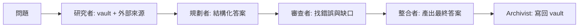

# 多 AI 協作與多 Agent 工作流 / Multi-AI and Multi-Agent Workflow

> 目標：讓 Codex、Claude 與多個專責 Agent 彼此分工、審查與整合，最後把結果沉澱回 Obsidian vault。

## 1. 核心觀念

多 AI 協作不是「讓越多 AI 一起講話越好」，而是把任務拆成不同角色，讓每個角色有明確輸入、輸出與審查責任。

最小可用分工：

| 角色 | 適合工具 | 責任 |
|---|---|---|
| 使用者 | 人 | 定義目標、取捨、最後決策 |
| Orchestrator 整合者 | Codex 或 Claude | 拆任務、分派、整合結果 |
| Researcher 研究者 | Codex/Claude 子代理 | 搜尋資料、讀筆記、整理來源 |
| Planner 規劃者 | Claude 或 Codex | 產生路線圖、里程碑、風險 |
| Critic 審查者 | Claude/Codex 子代理 | 找漏洞、反例、缺少來源 |
| Archivist 知識庫整理者 | Codex | 寫入 vault、補 wikilink、更新首頁 |

## 2. 什麼時候需要多 Agent

適合：

- 要查很多來源的研究。
- 要同時比較多個工具或方案。
- 要做重要決策，希望有人提出反方意見。
- 要整理大量筆記，並檢查連結、分類、缺口。
- 任務可以平行拆開，例如安全、品質、測試、可維護性分別審查。

不適合：

- 單純改寫一句話。
- 問一個已在 vault 有答案的概念。
- 任務很小，但多 Agent 協調成本比任務本身還高。

## 3. Codex + Claude 的實用分工

### 模式 A：Codex 先規劃，Claude 辯論整合

適合：專案規劃、學習路線、工具選型。

流程：

1. Codex 讀 vault，產出初版規劃。
2. 把規劃交給 Claude，要求它扮演審查者：找盲點、衝突、過度設計、缺少下一步。
3. Codex 讀 Claude 的批評，整合成第二版。
4. 使用者決定採納哪些建議。
5. Codex 寫回 vault。

給 Claude 的提示範例：

```text
請你扮演嚴格的專案審查者。下面是 Codex 根據我的 Obsidian AI 學習知識庫做出的規劃。
請你不要重寫全文，而是找出：
1. 目標是否清楚
2. 哪些地方過度設計
3. 哪些地方缺少可執行下一步
4. 哪些假設可能錯
5. 你建議保留、刪除、補強的項目
最後給一份精簡版修正建議。
```

### 模式 B：Codex 多子代理平行審查

適合：大型 vault 稽核、程式碼專案審查、長篇研究。

子代理分工：

- `explorer`：只讀檔案，找現有結構與相關筆記。
- `researcher`：查外部來源或官方文件。
- `critic`：專門找推論漏洞、缺少來源、概念混淆。
- `archivist`：根據整合結果寫入 vault。

整合者輸出格式：

```markdown
## 共識
- 

## 分歧
- 分歧點：
- A 方理由：
- B 方理由：
- 採納：
- 原因：

## 寫入 vault 的更新
- 

## 待確認
- 
```

### 模式 C：研究者 + 審查者 + 整理者

適合：重要概念更新，例如 Agent、MCP、RAG、模型能力變化。

流程：



## 4. 多 Agent 的品質規則

每個 Agent 必須遵守：

- 不知道就標明不知道。
- 外部資訊要有來源。
- 只輸出自己角色負責的內容。
- 不要把推論偽裝成事實。
- 審查者要指出「為什麼這是問題」，不是只說不好。
- 整合者要列出採納與未採納理由。

## 5. 防止多 Agent 失控

常見問題：

| 問題 | 解法 |
|---|---|
| 成本變高 | 只有大型任務才開多 Agent |
| 結果互相矛盾 | 整合者必須列分歧與採納理由 |
| 上下文污染 | 讓研究型子代理只回摘要，不回整段原文 |
| 每個 Agent 都在重做同一件事 | 任務分派時明確限定角色與輸出 |
| 寫回 vault 太亂 | 由 Archivist 統一整理與連結 |

## 6. 對本 vault 的推薦用法

### 每週知識庫整理

1. Codex 掃描 Inbox、Daily、Weekly。
2. Explorer 找孤島筆記與缺少 frontmatter 的筆記。
3. Critic 檢查哪些內容沒有來源或沒有連回核心概念。
4. Archivist 更新筆記、補連結、列下週待辦。

### 重要問題回答

當使用者問重要 AI 知識問題：

1. Codex 先讀相關 vault 筆記。
2. 若涉及最新狀態，查官方來源。
3. 若問題複雜，開研究者與審查者兩個子代理。
4. 最終回答分成：根據 vault、外部最新、我的建議。
5. 若發現 vault 缺口，新增或更新筆記。

### 專案規劃

1. Codex 先提出版本 1。
2. Claude 扮演反方審查。
3. Codex 整合為版本 2。
4. 使用者確認後，Codex 寫入 vault。

## 7. 可參考的框架與文件

- OpenAI Agents SDK：支援用 LLM 決定流程、用程式碼編排流程，也支援 agents as tools 與 handoffs。來源：https://openai.github.io/openai-agents-python/multi_agent/
- Codex Subagents：Codex 可明確要求啟動子代理，適合平行探索、審查與大型任務。來源：https://developers.openai.com/codex/codex-manual.md
- Claude Code Subagents：Claude Code 支援專責 subagents、工具限制、模型選擇、權限與記憶設定。來源：https://code.claude.com/docs/en/sub-agents
- Microsoft AutoGen AgentChat：提供 Agents、Teams、Selector Group Chat、Swarm、GraphFlow、Memory/RAG 等多 Agent 模式。來源：https://microsoft.github.io/autogen/stable/user-guide/agentchat-user-guide/index.html
- CrewAI Agents：以 role、goal、tools、memory、delegation 等屬性組織 agent。來源：https://docs.crewai.com/en/concepts/agents

## 8. 下一步

- 建立常用提示：`Codex 規劃 → Claude 審查 → Codex 整合`。
- 為 vault 建立月度稽核流程。
- 若多 Agent 工作流重複使用，封裝成 Codex Skill。
