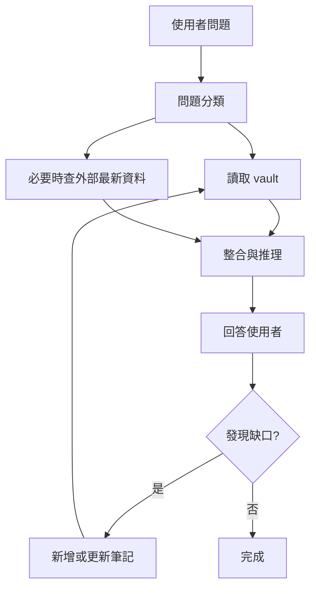

# 專案規劃 - Codex 個人學習知識庫

> 目標：把這個 Obsidian vault 變成 Codex / Claude 回答 AI 相關問題時的「可檢索長期記憶」，讓回答更貼近我的學習路線、概念框架與實際應用目標。

## 1. 目前狀態

已經具備的基礎：

- 有清楚資料夾結構：首頁、核心概念、關係地圖、應用工作流、每日快訊、每週精選、收件匣、範本、自動化。
- 有核心概念入口：[[🗺️ AI 全景地圖]] 與 9 篇概念筆記。
- 有基本 RAG 思維：讓 AI 先讀 vault，再回答問題。
- 有自動策展雛形：每日快訊、每週精選與 prompt 腳本。
- 有 Claude 使用規範：`CLAUDE.md` 已描述 vault 結構與回答準則。

## 2. 主要不足

### A. Codex 啟動規則不足

外層 `AGENTS.md` 指向內層 `個人學習/AGENTS.md`，但內層原本沒有 `AGENTS.md`。這會讓 Codex 缺少真正可讀的專案級操作規範。

改善：

- 補上內層 `AGENTS.md`。
- 把「回答前怎麼檢索 vault」「何時查外部資料」「新筆記寫到哪裡」寫成明確規則。

### B. 知識成熟度還沒有評估機制

目前有 `status: 🌱 / 🌿 / 🌳`，但缺少升級標準。結果是筆記可能標成常青，但內容沒有經過驗證、來源、應用案例或反例補強。

改善：

| 成熟度 | 判斷標準 |
|---|---|
| 🌱 種子 | 有初步定義或摘錄，但缺少完整脈絡 |
| 🌿 成長 | 有定義、應用、關聯筆記與至少一個例子 |
| 🌳 常青 | 有清楚心智模型、常見誤解、應用場景、來源與更新紀錄 |

### C. 缺少「我的學習路線」顯性化

目前有 AI 全景地圖，但還沒有把「我個人要怎麼從基礎走到進階應用」寫成可追蹤路線。

改善：

- 建立一篇 `AI 學習路線圖`。
- 每個階段包含：要懂的概念、要做的練習、可問 Codex 的問題、完成標準。
- 將每日快訊與每週精選連回學習路線，而不只是存新聞。

### D. 缺少「AI 如何使用我的 vault」的問答協議

目前只說先查 vault，但沒有規定查哪些檔、怎麼引用、何時承認不知道。

改善：

- 對每個問題先判斷類型：概念解釋、工具比較、專案規劃、最新資訊、個人複習。
- 每種類型指定要讀的資料夾與輸出格式。
- 回答中區分：vault 已知、外部最新、我的推論。

### E. 多 AI 協作還沒有工作流

目前 [[工作流範式]] 已提到多 Agent，但缺少「Codex 做什麼、Claude 做什麼、誰審查誰、如何沉澱回 vault」。

改善：

- 新增 [[多 AI 協作與多 Agent 工作流]]。
- 針對規劃、研究、寫作、審查、知識庫維護設計固定角色。

## 3. 建議目標架構

這個架構的重點不是「AI 記住所有事」，而是讓 AI 每次都能回到同一套知識索引，逐步累積共同上下文。

## 4. Codex 使用 vault 的標準流程

### 概念問題

例如：「MCP 和 Skill 差在哪？」

1. 讀 [[🗺️ AI 全景地圖]]。
2. 讀相關概念筆記：[[MCP (Model Context Protocol)]]、[[Skill 技能]]、[[Agent 代理]]。
3. 用本 vault 的語言回答。
4. 若有最新產品變化，再查官方文件補充。

### 專案規劃問題

例如：「我該怎麼改進這個知識庫？」

1. 讀首頁、地圖、工作流與自動化 README。
2. 檢查目前檔案結構。
3. 找出結構缺口、流程缺口、內容缺口。
4. 直接新增或更新規劃筆記。

### 最新資訊問題

例如：「最近 Agent 有什麼重要發展？」

1. 先讀每日快訊與每週精選。
2. 若內容不足，搜尋官方文件、研究論文或可信來源。
3. 回答時標明日期與來源。
4. 重要內容沉澱成快訊、週報或概念更新。

## 5. 建議新增的筆記

優先順序：

1. `AI 學習路線圖.md`：把基礎、進階、工具、專案四階段拆開。
2. `Codex 使用手冊.md`：記錄如何請 Codex 讀 vault、改筆記、跑自動化。
3. `Claude 協作手冊.md`：記錄哪些任務適合丟給 Claude 做整合或反方審查。
4. `知識庫品質檢查清單.md`：每月檢查孤島筆記、過期筆記、缺少來源的筆記。
5. `AI 工具決策紀錄.md`：記錄為什麼選 Codex、Claude、MCP、某個自動化方案。

## 6. 每週維護節奏

| 頻率 | 動作 | 產出 |
|---|---|---|
| 每天 | 擷取新問題、新文章、新工具 | Inbox 或 Daily |
| 每週 | 清空 Inbox、整理 Daily、寫 Weekly | 週報與概念連結 |
| 每月 | 檢查學習路線、升級成熟筆記 | 更新地圖與首頁 |
| 每季 | 回顧工具鏈與自動化 | 新工作流或刪除無效流程 |

## 7. 成功指標

這個專案不是以筆記數量為成功，而是以「回答品質」為成功。

可追蹤指標：

- 問 AI 相關問題時，Codex 能引用 2-3 篇 vault 筆記。
- 每篇新筆記至少有 2 個 wikilink。
- 每週至少有 1 篇快訊或週報被反向連回核心概念。
- 每月有 1 篇 🌱 筆記升級成 🌿 或 🌳。
- 對重要問題，回答能區分「vault 既有知識」「外部最新資料」「AI 推論」。

## 8. 下一步

- 建立 `AI 學習路線圖.md`。
- 把 [[多 AI 協作與多 Agent 工作流]] 變成固定操作手冊。
- 增加每月回顧 prompt：檢查孤島筆記、過期筆記、缺少來源筆記。
- 視需要把常用流程封裝成 Codex Skill 或 Claude subagent。
