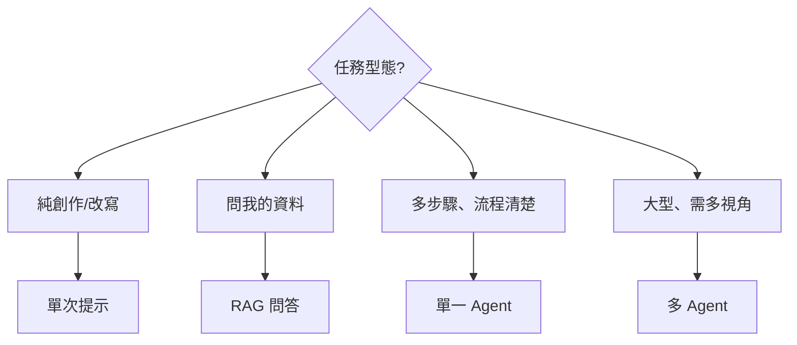

# 工作流範式 / Workflow Patterns

> 同樣是用 AI，組裝方式不同、適用情境也不同。先判斷任務型態，再選範式。

## 1. 單次提示 Single Prompt
- **是什麼：** 一問一答，不用工具。
- **適合：** 寫作、改寫、翻譯、腦力激盪、解釋概念。
- **關鍵：** [[Prompt 提示工程]] 寫好就夠。
- **取捨：** 最快最便宜；但不能查最新、不能多步驟。

## 2. RAG 問答 Retrieval QA
- **是什麼：** 先檢索你的資料，再據此回答。見 [[RAG 檢索增強生成]]。
- **適合：** 問私有文件、知識庫、產品手冊、法規。
- **取捨：** 答案有依據、可附出處；但受檢索品質影響。

## 3. 單一 Agent 自動化 Single-Agent
- **是什麼：** 給目標，讓一個 [[Agent 代理]] 規劃→行動→修正跑完。
- **適合：** 多步驟但流程清楚的任務（抓新聞→整理→寫筆記、改一段程式）。
- **取捨：** 省人力；需設好目標與權限，會犯錯要可檢查。

## 4. 多 Agent 協作 Multi-Agent
- **是什麼：** 拆成多個專責 Agent（研究者／撰寫者／審查者）分工。
- **適合：** 大型、需多視角或平行處理的任務（深度研究、跨領域報告）。
- **取捨：** 涵蓋更廣、品質更穩；但協調成本與花費高，簡單任務別硬上。
- **本庫做法：** Codex 負責讀寫 vault 與落地整理，Claude 可作為整合與反方審查；詳細流程見 [[多 AI 協作與多 Agent 工作流]]。

## 選擇指南 Decision Guide

## 心法 Principles
- **由簡入繁**：先試單次提示，不夠再升級，別一開始就上多 Agent。
- **人在迴圈 Human-in-the-loop**：自動化程度越高，越要設檢查點。
- **明確邊界**：給 Agent 清楚的目標、可用工具、與「不可以做什麼」。

延伸：實際範例見 [[案例-自動策展知識庫]]、[[多 AI 協作與多 Agent 工作流]]。
