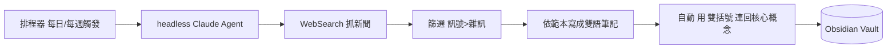

# 案例 - 自動策展知識庫 / Auto-Curation Case

> 這個 vault 本身就是一個活教材：它示範了怎麼把多個概念「拼」成一個會自己長大的系統。

## 目標 Goal
讓知識庫每天自動補進 AI 領域的重要新聞，每週彙整成深度 digest，並自動連回我的核心概念筆記。

## 組裝配方 Building Blocks
這是一個 **單一 [[Agent 代理]]** 工作流（見 [[工作流範式]]）：

| 零件 | 在這裡扮演 |
|---|---|
| [[LLM 大型語言模型]] | 判斷哪些新聞重要、寫摘要 |
| [[Tool Use 工具呼叫]] | WebSearch 抓新聞、WebFetch 讀來源、寫檔工具存筆記 |
| [[Prompt 提示工程]] | `_自動化/daily-prompt.md`、`weekly-prompt.md` 定義它怎麼做 |
| [[Context 脈絡與記憶]] | vault 本身就是它的長期記憶（讀舊快訊彙整週報）|
| [[Skill 技能]] | 未來可把整套流程封裝成「知識策展 Skill」|

## 運作流程 How it runs

## 兩種啟動方式 Two ways to run
- **全自動（Setup A）**：Windows 工作排程器定時跑 `claude -p`。設定見 [[_自動化 Automation/README]]。
- **手動（Setup B）**：在 vault 開 `claude`，說「跑每日快訊」。

## 心得 Takeaways
- 這就是「[[Agent 代理]] = LLM + Tool Use 迴圈」的具體化。
- prompt 裡刻意要求「訊號 > 雜訊」「不杜撰來源」「自動連回概念」——這三條是品質關鍵。
- 系統會反向提醒你哪些概念該補充（檔尾待辦），形成「新聞 → 更新理解」的閉環。

## 延伸 Next steps
- 把抓取主題客製成你關心的領域。
- 加上「每月回顧」prompt，從週報再彙整成趨勢長文。
